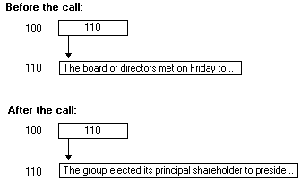

# Reference Pointers

Reference pointers are the simplest pointers and require the least amount of processing by the client stub. When a client program passes a reference pointer to a remote procedure, the reference pointer always contains the address of a valid block of memory. It will still be pointing to the same memory block when the remote procedure completes. These pointers are mainly used to implement reference semantics, and to allow for \[[**out**](/windows/desktop/Midl/out-idl)\] parameters in C.

In the following example, the value of the pointer does not change during the call, although the contents of the data at the address indicated by the pointer can change.



A reference pointer has the following characteristics:

-   It always points to valid storage and never has the value **NULL**.
-   It never changes during a call and always points to the same storage before and after the call.
-   Data returned from the remote procedure is written into the existing storage.
-   The storage pointed to by a reference pointer cannot be accessed by any other pointer or any other name in the function.

Use the \[[**ref**](/windows/desktop/Midl/ref)\] attribute to specify reference pointers in interface definitions, as shown in the following example.

``` syntax
/* IDL file */
[ 
  uuid(ba209999-0c6c-11d2-97cf-00c04f8eea45),
  version(1.0)
]
interface RefPtrInterface
{
  void RemoteFn([in, out, ref] char *pChar);
}
```

This example defines the parameter *pChar* as a pointer to a single character, not an array of characters. It is an \[**out**\] parameter and a reference pointer that points to memory that the server routine RemoteFn will fill with data.

 

 