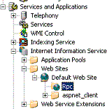
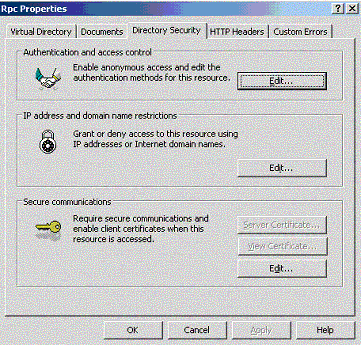

# RPC over HTTP Security

RPC over HTTP provides three types of security in addition to standard RPC security, which results in RPC over HTTP traffic being protected once by RPC, and then doubly protected by the tunneling mechanism provided by RPC over HTTP. For a description of standard RPC security mechanisms, see [Security](security.md). The RPC over HTTP tunneling mechanism adds to normal RPC security in the following manner:

-   Provides security through the IIS (available for RPC over HTTP v2 only).
-   Provides SSL encryption and RPC Proxy verification (mutual authentication). Also available in RPC over HTTP v2 only.
-   Provides restrictions on the RPC Proxy level dictating which machines on the server network are allowed to receive RPC over HTTP calls.

Each of these three security features is described in more detail in following sections.

## IIS Authentication

RPC over HTTP can leverage the normal authentication mechanism of IIS. The virtual directory for RPC Proxy can be configured using the Rpc node under the Default Web Site in the IIS MMC snap-in:



IIS can be configured to disable anonymous access and require authentication to the virtual directory for the RPC Proxy. To do this, right click the Rpc node and select **Properties**. Select the **Directory Security** tab and click the **Edit** button in the **Authentication and Access Control** group, as illustrated here:



Although you can use RPC over HTTP even when the RPC Proxy virtual directory allows anonymous access, Microsoft strongly recommends disabling anonymous access to that virtual directory for security reasons. Rather, for RPC over HTTP enable Basic Authentication, Windows Integrated Authentication or both. Remember that only RPC over HTTP v2 is able to authenticate against RPC Proxy requiring Basic or Windows-integrated authentication; RPC over HTTP v1 will not be able to connect if **Disallow Anonymous Access** is disabled. Since RPC over HTTP v2 is the more secure and robust implementation, using a version of Windows that supports it will improve the security of your installations.

> [!Note]  
> By default, the RPC proxy virtual directory is marked to allow anonymous access. However, the RPC proxy for RPC over HTTP v2 rejects requests that are not authenticated by default.

 

## Traffic Encryption

RPC over HTTP can encrypt traffic between the RPC over HTTP client and the RPC proxy with SSL. The traffic between the RPC proxy and RPC over HTTP server is encrypted using normal RPC security mechanisms and does not use SSL (even if SSL between the client and the RPC proxy is chosen). This is because that portion of the traffic travels within an organization's network and behind a firewall.

Traffic between the RPC over HTTP client and the RPC proxy, which generally travels over the Internet, can be encrypted with SSL in addition to which encryption mechanism was chosen for RPC. In this case, traffic on the Internet portion of the route becomes doubly encrypted. Encrypting traffic through the RPC proxy provides a secondary defense, in case the RPC proxy or other machines in the perimeter network are compromised. Since the RPC proxy cannot decrypt the secondary encryption layer, the RPC proxy does not have access to the data being sent. See [RPC over HTTP Deployment Recommendations](rpc-over-http-deployment-recommendations.md) for more information. SSL encryption is available only with RPC over HTTP v2.

## Restricting RPC over HTTP Calls to Certain Computers

The IIS security configuration is based on allowed computer and port ranges. The capability to use RPC over HTTP is controlled by two registry entries on the computer running IIS and the RPC proxy. The first entry is a flag that toggles RPC proxy functionality. The second is an optional list of computers to which the proxy can forward RPC calls.

By default, a client that contacts the RPC proxy to tunnel RPC over HTTP calls cannot access any RPC server processes except the RPC over HTTP server processes running on the same machine as the RPC proxy. If the ENABLED flag is not defined or set to a zero value, IIS disables the RPC proxy. If the ENABLED flag is defined and set to a nonzero value, a client can connect to RPC over HTTP servers on the computer running IIS. To enable the client to tunnel to an RPC over HTTP server process on another computer, you must add a registry entry to the IIS computer's list of RPC over HTTP servers.

RPC servers cannot accept RPC over HTTP calls unless they specifically requested RPC to listen on RPC over HTTP.

The following example demonstrates how to configure the registry to allow clients to connect to servers across the Internet:

```
HKEY_LOCAL_MACHINE\
   Software\Microsoft\Rpc\RpcProxy\Enabled:REG_DWORD
   Software\Microsoft\Rpc\RpcProxy\ValidPorts:REG_SZ
```

The **ValidPorts** entry is a REG\_SZ entry containing a list of computers to which the IIS RPC proxy is allowed to forward RPC calls, and the ports it should use to connect to the RPC servers. The REG\_SZ entry takes the following form: Rosco:593;Rosco:2000-8000;Data\*:4000-8000.

In this example, IIS can forward RPC over HTTP calls to the server "Rosco" on ports 593 and 2000 through 8000. It can also send calls to any server whose name begins with "Data". It will connect on ports 4000 through 8000. In addition, before forwarding traffic to a given port on the RPC over HTTP server, the RPC proxy performs a special packet exchange with the RPC service listening on that port to verify it is willing to accept requests over HTTP.

For an example based on these example settings, if an RPC service listens on port 4500 on server "Data1" but has not called one of the [**RpcServerUseProtseq\***](/windows/desktop/api/Rpcdce/nf-rpcdce-rpcserveruseprotseq) functions with **ncacn\_http**, it will reject the request. This behavior provides additional protection for servers that listen on an opened port due to configuration error; unless the server specifically requested to listen on RPC over HTTP, it will not receive calls originating from outside the firewall.

Entries in the **ValidPorts** key must be an exact match of the RPC over HTTP server asked for by the client (it is not case-sensitive). To streamline processing, the RPC proxy does not perform canonicalization of the name provided by the RPC over HTTP client. Therefore, if the client asks for rosco.microsoft.com, and in **ValidPorts** contain Rosco only, the RPC proxy will not match the names, even though both names may refer to the same machine. Additionally, if the IP address of Rosco is 66.77.88.99, and the client asks for 66.77.88.99 but the **ValidPorts** key contains Rosco only, the RPC proxy will refuse the connection. If a client may ask for the RPC over HTTP server by name, or by IP address, insert both in the **ValidPorts** key.

> [!Note]  
> Although RPC is IPv6 enabled, the RPC proxy does not support IPv6 addresses in the **ValidPorts** key. If IPv6 is used to connect the RPC proxy and the RPC over HTTP server, only DNS names can be used.

 

IIS reads the **Enabled** and **ValidPorts** registry entries on startup. In addition, RPC over HTTP rereads the contents of the **ValidPorts** key approximately every 5 minutes. If the **ValidPorts** entry is changed, the changes are implemented within 5 minutes.

**RPC over HTTP v1:** The WEB service must be stopped and restarted using the Internet Service Manager for new values in the registry entries to be implemented.

 

 


