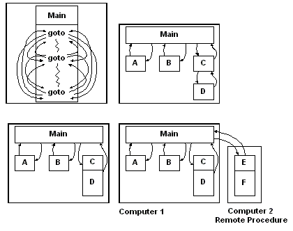
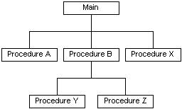

# The Programming Model

In the early days of computer programming, each program was written as a large monolithic chunk, filled with **goto** statements. Each program had to manage its own input and output to different hardware devices. As the programming discipline matured, this monolithic code was organized into procedures, with the most commonly used procedures packed in libraries for sharing and reuse.

The C programming language supports procedure-oriented programming. In C, the main procedure relates to all other procedures as black boxes. For example, the main procedure cannot find out how procedures A, B, and X do their work. The main procedure only calls another procedure; it has no information about how that procedure is implemented.

Procedure-oriented programming languages provide simple mechanisms for specifying and writing procedures. For example, the ANSI-standard C-function prototype is a construct used to specify the name of a procedure, the type of the result it returns (if any) and the number, sequence, and type of its parameters. Using the function prototype is a formal way to specify an interface between procedures.

Microsoft RPC builds on that programming model by allowing procedures, grouped together in interfaces, to reside in different processes than the caller. Microsoft RPC also adds a more formal approach to procedure definition that allows the caller and the called routine to adopt a contract for remotely exchanging data and invoking functionality. In the Microsoft RPC programming model, traditional function calls are supplemented with two additional elements.

-   The first element is an .idl/.acf file that precisely describes the data exchange and parameter-passing mechanism between the caller and called procedure.
-   The second element is a set of run-time APIs that provide developers with granular control of the remote procedure call, including security aspects, managing state on the server, specifying which clients can talk to the server, and so on.

 

 

