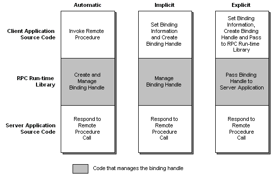

# Types of Binding Handles

Binding handles can be automatic, implicit, or explicit. They differ in the amount of control the application has over the binding process. As the name suggests, automatic binding handles automate binding. The client and server applications do not need code to handle the binding process. Implicit binding handles allow client programs to configure the binding handle before the binding takes place. After the client establishes a binding, the RPC run-time library handles the rest. Explicit binding handles move complete control over the binding process into the source code of the client and the server programs. With this control comes increased complexity. Your application must call RPC functions to manage the binding. It does not happen automatically. Explicit binding handles are recommended.

The following diagram illustrates the differences between automatic, implicit, and explicit binding handles.

In addition, every binding handle is either primitive or custom. Each type of binding handle is discussed in the following topics:

-   [Automatic Binding Handles](automatic-binding-handles.md)
-   [Implicit Binding Handles](implicit-binding-handles.md)
-   [Explicit Binding Handles](explicit-binding-handles.md)
-   [Primitive and Custom Binding Handles](primitive-and-custom-binding-handles.md)

 

 

