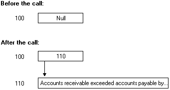

# Unique Pointers

In C programs, more than one pointer can contain the address of data. The pointers are said to create an [*alias*](a-glos.md) for the data. Aliases are also created when pointers point at declared variables. The following code fragment illustrates both of these methods of aliasing:


```C++
int iAnInteger=50;

// The next statement makes ipAnIntegerPointer an
// alias for iAnInteger.
int *ipAnIntegerPointer = &iAnInteger;

// This statement creates an alias for ipAnIntegerPointer.
int *ipAnotherIntegerPointer = ipAnIntegerPointer;
```


In a typical C program, you might specify a binary tree using the following definition:


```C++
typedef struct _treetype 
{
    long               lValue;
    struct _treetype * left;
    struct _treetype * right;
} TREETYPE;

TREETYPE * troot;
```


More than one pointer can access the contents of a tree node. This is generally fine for nondistributed applications. However, this style of programming generates more complicated RPC support code. The client and server stubs require the additional code to manage the data and the pointers. The underlying stub code must resolve the various pointers to the addresses and determine which copy of the data represents the most recent version.

The amount of processing can be reduced if you guarantee that your pointer is the only way the application can access that area of memory. The pointer can still have many of the features of a C pointer. For example, it can change between **null** and non-**null** values or stay the same. The following example illustrates this. The pointer is **null** before the call and points to a valid string after the call:



By default, the MIDL compiler applies the \[ [unique](/windows/desktop/Midl/unique)\] pointer attribute to all pointers that are not parameters. This default setting can be changed with the \[ [pointer\_default](/windows/desktop/Midl/pointer-default)\] attribute.

A unique pointer has the following characteristics:

-   It can have the value **null**.
-   It can change from **null** to non-**null** during the call. When the value changes to non-**null**, new memory is allocated on return.
-   It can change from non-**null** to **null** during the call. When the value changes to **NULL**, the application is responsible for freeing the memory.
-   The value can change from one non-**null** value to another.
-   The storage that a unique pointer points to cannot be accessed by any other pointer or name in the operation.
-   Return data is written into existing storage if the pointer does not have the value **null**.

The following example demonstrates how to define a unique pointer.

``` syntax
/* IDL file */
[ 
  uuid(ba209999-0c6c-11d2-97cf-00c04f8eea45),
  version(1.0)
]
interface RefPtrInterface
{
  void RemoteFn([in, unique] char *ach);
}
```

In this example, the parameter *ach* is a unique pointer to character data that is sent to a server to be processed with the RemoteFn routine.

 

 