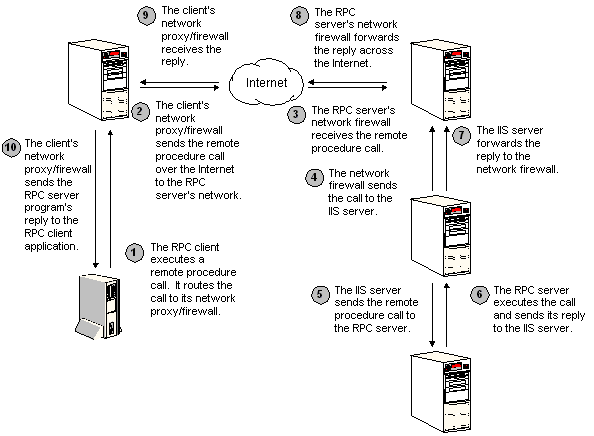

# Using HTTP as an RPC Transport

RPC-over-HTTP enables client programs to use the Internet to execute procedures provided by server programs on distant networks. RPC over HTTP tunnels its calls through an established HTTP port. Thus, its calls can cross network firewalls on both the client and server networks.

RPC over HTTP routes its calls to the RPC proxy located on the RPC server's network. The RPC Proxy establishes and maintains a connection to the RPC server. It serves as a proxy, dispatching remote procedure calls to the RPC server and sending the server's replies back across the Internet to the client application. This process is illustrated in the following diagram.



The diagram shows a firewall on the client application's network. This is not required for RPC over HTTP to operate. However, if the client network does have a firewall, it will also need a proxy server program such as Microsoft Proxy Server.

When the client program issues a remote procedure call using HTTP as the transport, the RPC run-time library on the client contacts the RPC proxy. Depending on whether the RPC client was asked to use HTTP or HTTPS (HTTP with SSL) port 80 or port 443 is used, respectively. The RPC proxy contacts the RPC server program and establishes a TCP/IP connection. The client and the RPC proxy maintain their HTTP or HTTPS connection across the Internet. The client's HTTP or HTTPS connection to the RPC proxy can pass through a firewall (subject to appropriate access permissions) if one is present. The server can then execute the remote procedure call and use the connection through the RPC proxy to reply to the client. The RPC proxy is an ISAPI extension running in the context of IIS.

If either the client or the server disconnects for any reason, the RPC proxy will detect it and end the RPC session. As long as the session continues, the RPC proxy will maintain its connections to the client and the server. It will forward remote procedure calls from the client to the server, and send replies from the server to the client.

The RPC client program can tunnel its RPC calls through the Internet by creating a string binding of the form:

``` syntax
[object_uuid@]ncacn_http:rpc_server[endpoint,HttpProxy=proxy_server:http_port,RpcProxy=rpc_proxy:rpc_port,HttpConnectionOption=UseHttpProxy]
```

Where:

-   *object\_uuid* specifies an RPC object UUID. For more information, see [Generating Interface UUIDs](generating-interface-uuids.md) and [String UUID](string-uuid.md).
-   **ncacn\_http** selects the protocol sequence specification for RPC over HTTP. For more information, see [Protocol Sequence Constants](protocol-sequence-constants.md) and [String Binding](string-binding.md).
-   *rpc\_server* is the network address of the computer that is executing the RPC server process. The server address must be specified in a form visible and understandable by the RPC proxy computer, not by the client. Since the client does not connect directly to the server, it does not need to be able to resolve the name of the server, or establish a connection to it. The RPC proxy will establish the connection on the client's behalf, and therefore, *rpc\_server* must be a name recognizable by the RPC proxy.
-   *endpoint* specifies the TCP/IP port that the RPC server process listens to for remote procedure calls. For more information, see [Finding Endpoints](finding-endpoints.md).
-   **HttpProxy** optionally specifies an HTTP proxy server on the RPC client's network, such as Microsoft Proxy Server. If a proxy server is selected, no port number is specified, the RPC stub uses port 80 by default if SSL is not requested, and port 443 if SSL is specified.
-   **RpcProxy** specifies the address and port number of the IIS computer that acts as a proxy to the RPC server. You only need to specify this if the RPC server process resides on a different computer than the RPC proxy. If you do not specify a port number, the RPC client stub by default uses port 80 if SSL is not specified, and uses port 443 if SSL (HTTPS) is specified.
-   **HttpConnectionOption** optionally allows you to direct RPC’s behavior when making HTTP connections. The **UseHttpProxy** value instructs RPC to route its traffic through the Http proxy at all times, including when the client has their Internet Options set in Internet Explorer to “Bypass proxy server for local addresses.”

    This option is supported on Windows 7, Windows Server 2008 R2, Windows 8.1, and Windows Server 2012 R2 with KB2916915 installed. This option is not supported on Windows 8 and Windows Server 2012. Applications can determine if this option is supported by the RPC runtime by checking the **ConnectionOptionsFlag** registry value located under the following registry key:

    **HKEY\_LOCAL\_MACHINE\\SOFTWARE\\Microsoft\\Rpc**

    If the bit 0 (LSB) of this registry value is set, then this specific option is supported; otherwise, this option is not supported by the RPC runtime in the system.

For more information on creating string bindings, see [Binding and Handles](binding-and-handles.md).

The RPC server program can accept tunneled RPC calls by listening on the ncacn\_http protocol sequence.

Microsoft has two major implementations of RPC over HTTP: Version 1 and Version 2.

Version 1 (called RPC over HTTP v1) is supported through Windows XP. Version 1 of the RPC proxy is supported through Windows 2000.

Version 2 (called RPC over HTTP v2) is the current version.

The two versions have different capabilities and limited interoperability. A summary of the differences is provided here. For interoperability considerations, see [System Requirements and Interoperability for RPC over HTTP](system-requirements-and-interoperability-for-rpc-over-http.md).

-   RPC over HTTP v1 requires SSL Tunneling to be enabled on all HTTP proxies/firewalls between the RPC over HTTP client and the RPC proxy. RPC over HTTP v1 attempts to build an SSL Tunnel over port 80 even though the data it sends is not actually SSL-encrypted. Proxies and firewalls usually reject such requests unless explicitly configured to allow them. RPC over HTTP v2 has no such requirement.
-   RPC over HTTP v1 cannot establish an SSL session to the RPC proxy. The RPC over HTTP v2 can send all RPC over HTTP traffic within an SSL session; by default v2 requires the data be sent within an SSL session.
-   RPC over HTTP v1 cannot authenticate to the RPC proxy. RPC over HTTP v2 can authenticate; by default v2 requires authentication to the RPC proxy.
-   RPC proxy v1 does not operate correctly when the IIS machine on which it is installed is part of a web farm. RPC proxy v2 operates properly when the IIS machine on which it is installed is part of a web farm.

> [!Note]  
> If Microsoft Internet Explorer is installed on the client program's computer and your client does not specify an **HttpProxy** in its string binding, the RPC client stub will search the registry on the client computer for an **HttpProxy** entry. If it finds one, it will use the proxy specified in the registry entry.

 

Suppose, for instance, your client program needs to connect across the Internet to an RPC server on a computer called Server7.microsoft.com. Further, suppose that the RPC proxy runs on Major7.microsoft.com. The RPC server program listens to port 2225. Your client would use the string binding:

``` syntax
ncacn_http:Server7.microsoft.com[2225, RpcProxy=Major7.microsoft.com]
```

If the RPC proxy can resolve the server name as Server7, without requiring a fully qualified domain name, you can also specify:

``` syntax
ncacn_http:Server7 [2225, RpcProxy=Major7.microsoft.com]
```

If the client network uses a firewall and an Internet proxy server called myproxy, and Internet Explorer on the client is not configured to use that proxy, you would need to modify the client's string binding to:

``` syntax
ncacn_http:Server7.microsoft.com[,HttpProxy=myproxy:80,RpcProxy=Major7.microsoft.com:80]
```

This directs the client to connect to the RPC server program on Server7.microsoft.com. To do this, the client will first use port 80 (or port 443 if SSL is used) to connect to myproxy. This will give the client program access to the Internet. Using the Internet, the client program next connects to the RPC proxy on Major7.microsoft.com. The RPC proxy will establish a connection to the RPC server program running on Server7.microsoft.com.

If the client network uses a firewall and if the RPC proxy cannot be reached directly, in order to get a connection established faster, the client string binding can be modified to:

``` syntax
ncacn_http:Server7.microsoft.com[RpcProxy=Major7.microsoft.com:80,HttpConnectionOption=UseHttpProxy]
```

The **HttpConnectionOption** allows you to direct RPC’s behavior when making HTTP connections. The **UseHttpProxy** value instructs RPC to route its traffic through the Http proxy at all times, including when the client has their Internet Options set in Internet Explorer to “Bypass proxy server for local addresses.” This directs the client to forcefully connect to the RPC proxy through the Http proxy. This speeds up the time to establish a connection since it bypasses any delay searching for the RPC server directly prior to using the HTTP proxy.

If the **HttpConnectionOption** option is used and Internet Explorer on the client is not configured to use that Http proxy, connections may fail with **RPC\_S\_INVALID\_NETWORK\_OPTIONS**.

The vast majority of computers today are configured for Web browsing. Therefore, most clients do not need to specify the **HttpProxy**, because it will be retrieved from Internet connectivity settings.

 

 


