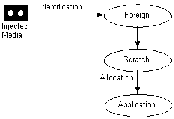
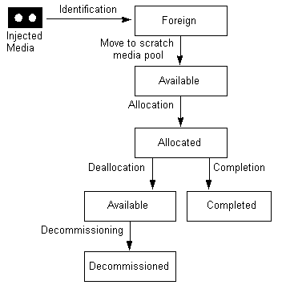

# Media Life Cycle

\[[Removable Storage Manager](removable-storage-manager.md) is no longer available as of Windows 7 and Windows Server 2008 R2.\]

Most media in RSM follow the same life cycle; variations are necessitated by unusual situations. The following figure illustrates the typical cycle of RSM media.

When a new cartridge is inserted into a library, RSM typically puts the cartridge in either the import or the unrecognized media pool. The administrator or your application can move the cartridge to the appropriate free media pool using the [**MoveToNtmsMediaPool**](/windows/win32/Ntmsapi/nf-ntmsapi-movetontmsmediapool?branch=master) function.

The following figure illustrates the typical media state cycle of RSM media.

> [!Note]  
> When you use the [**MountNtmsMedia**](/windows/win32/Ntmsapi/nf-ntmsapi-mountntmsmedia?branch=master) function to mount tape media, remember that your application must specifically set the drive to fixed or variable block mode. Your application cannot assume that the device is in the default mode. You can use the [**SetTapeParameters**](https://msdn.microsoft.com/library/windows/desktop/aa362534) function to set the drive mode.

 

When you do not want to record any more information on the cartridge, you can set the its state to Completed using the [**SetNtmsMediaComplete**](/windows/win32/Ntmsapi/nf-ntmsapi-setntmsmediacomplete?branch=master) function. Typically, Completed media is not written to again. Placing a cartridge in the Completed state allows a management application to replicate or refresh the media.

Media that hold less vital information and are recorded on many times are typically decommissioned after the maximum number of allocations. Only Available media can be decommissioned, so you must use the [**DeallocateNtmsMedia**](/windows/win32/Ntmsapi/nf-ntmsapi-deallocatentmsmedia?branch=master) function before you can decommission a piece of media. You can use the [**DecommissionNtmsMedia**](/windows/win32/Ntmsapi/nf-ntmsapi-decommissionntmsmedia?branch=master) function to decommission Available media.

After you deallocate media, you can leave the media in the application media pool or move it to a free media pool so that it can be used by other applications. Your application can reallocate Available media that remains in the application media pool until it has reached its allocation maximum (determined by the administrator or an application).

 

 

