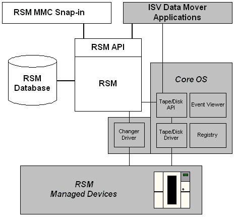

# RSM Architecture

\[[Removable Storage Manager](removable-storage-manager.md) is no longer available as of Windows 7 and Windows Server 2008 R2.\]

RSM consists of the following:

-   [RSM API](rsm-api.md)
-   [RSM database](rsm-database.md)
-   [RSM MMC snap-in](rsm-mmc-snap-in.md)

The following figure illustrates the relationships among the RSM API, database, and MMC snap-in; the managed devices; and Windows. (The RSM API, database, and MMC snap-in are shown in solid white.)

When an application needs to mount a tape, for example, it uses the [**MountNtmsMedia**](/windows/desktop/api/Ntmsapi/nf-ntmsapi-mountntmsmedia) function to issue a mount request for the specified tape. RSM reads the database for location and identification information of the tape. If the tape is offline, RSM generates an operator request to insert it. If the tape is online, RSM uses the changer driver to mount it and updates the database. When the tape is in the drive RSM uses the tape driver to read the label on the tape. RSM then compares what was read from the database to what was expected to ensure the correct tape was mounted.

 

 

