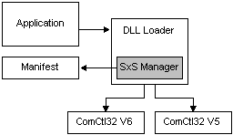

# About Side-by-Side Assemblies

A Windows side-by-side assembly is described by [manifests](manifests.md). A side-by-side assembly contains a collection of resources—a group of DLLs, Windows classes, COM servers, type libraries, or interfaces—that are always provided to applications together. These are described in the assembly manifest.

Typically, a side-by-side assembly is a single DLL. For example, the Microsoft COMCTL32 assembly is a single DLL with a manifest whereas the Microsoft Visual C++ development system run-time libraries assembly contains multiple files. Manifests contain [*metadata*](m-sbscs-gly.md) that describes side-by-side assemblies and side-by-side assembly dependencies.

Side-by-side assemblies are used by the operating system as fundamental units of naming, binding, versioning, deployment, and configuration. Every side-by-side assembly has a unique identity. One of the attributes of the assembly identity is its version. For more information, see [Assembly Versions](assembly-versions.md).

Starting with Windows XP, multiple versions of side-by-side assemblies can be used by applications running at the same time. Manifests, and the assembly version number, are used by the loader to determine the correct binding of assembly versions to applications. Side-by-side assemblies and manifests work with applications and the side-by-side manager as illustrated in the following figure.

In the preceding example, both Comctl32.DLL version 6.0 and Comctl32.DLL version 5.0 are in the side-by-side assembly cache and available to applications. When an application calls to load the DLL, the side-by-side manager determines whether the application has a version dependence described in a manifest. If there is no relevant manifest, the system loads the default version of the assembly. For Windows XP, version 5.0 of Comctl32.DLL is the system default. If the side-by-side manager finds a dependence on version 6.0 stated in a manifest, that version is loaded to run with the application.

Several key system assemblies are being made available from Microsoft as side-by-side assemblies. For more information, see [Supported Microsoft Side-by-side Assemblies](supported-microsoft-side-by-side-assemblies.md). Application developers can also create their own side-by-side assemblies. For more information, see [Guidelines for Creating Side-by-side Assemblies](guidelines-for-creating-side-by-side-assemblies.md). In many cases it is possible to update existing applications to use side-by-side assemblies without having to change the application code.

Developers are encouraged to use side-by-side assemblies to create [isolated applications](isolated-applications.md), and to update existing applications into isolated applications for the following reasons:

-   Side-by-side assemblies reduce the possibility of DLL version conflicts.
-   Side-by-side assembly sharing enables multiple versions of COM or Windows assemblies to run at the same time.
-   Applications and administrators can update assembly configuration on either a [global](publisher-configuration.md) or [per-application configuration](per-application-configuration.md) basis after deployment. For example, an application can be updated to use a side-by-side assembly that includes an update without having to reinstall the application.

 

 

