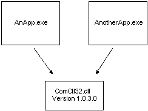
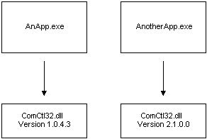

# Side-by-side Assembly Sharing

The following figure illustrates how two applications might share an assembly using the traditional method of assembly sharing. A problem with traditional assembly sharing occurs when an application installs a version of an assembly—commonly a DLL—that is not backward compatible. The application just installed works, but applications that depended on the previous DLL version may no longer work.

The isolated application and side-by-side assembly solution enables different versions of the same Win32 assembly to run at the same time on the same system without conflict. By specifying which side-by-side assembly version the application should use, developers can guarantee that the configuration they test will always be duplicated on the user's computer. Side-by-side sharing is illustrated in the following figure.

For more information, see [About Isolated Applications and Side-by-side Assemblies](about-isolated-applications-and-side-by-side-assemblies.md).

 

 

