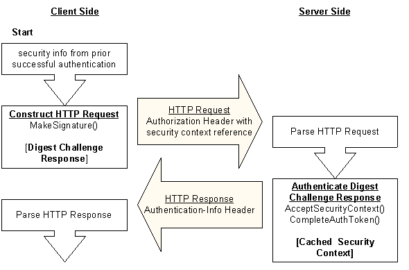

# Authenticating Subsequent Requests with Microsoft Digest

> [!NOTE]
> Starting in Windows 11 22H2, Microsoft is deprecating Microsoft Digest, also known as wDigest. We will continue to support Microsoft Digest on supported versions of Windows. Future versions of Windows will include limited capabilities for Microsoft Digest, and eventually Microsoft Digest will no longer be supported on Windows.

The server sends the client a reference to their shared [*security context*](/windows/desktop/SecGloss/s-gly) using the opaque directive of the Digest challenge. After a successful authentication, the client must specify this value in subsequent requests to the target server. Including the opaque value in requests for resources that are accessible using the existing security context eliminates the need to re-authenticate at the domain controller. Such requests are re-authenticated at the server, using the Digest [*session key*](/windows/desktop/SecGloss/s-gly) cached after the initial authentication.

The following diagram illustrates the steps taken by client and server during a subsequent request for access-protected resources.

To request additional resources after a successful authentication, the client calls the Microsoft Digest [**MakeSignature**](/windows/desktop/api/Sspi/nf-sspi-makesignature) function to generate a Digest challenge response. The opaque value is included in the opaque directive of the challenge response sent to the server as an Authorization header (shown as HTTP Request).

The server calls the [**AcceptSecurityContext (Digest)**](/windows/win32/api/sspi/nf-sspi-acceptsecuritycontext) function to determine whether there is an existing [*security context*](/windows/desktop/SecGloss/s-gly) for the client. When an existing context is found, the function returns SEC\_E\_COMPLETE\_NEEDED to indicate the server must then call the [**CompleteAuthToken**](/windows/desktop/api/Sspi/nf-sspi-completeauthtoken) function. This function performs the client authentication using the Digest [*session key*](/windows/desktop/SecGloss/s-gly) cached during the [initial authentication](initial-authentication-using-microsoft-digest.md) instead of re-authenticating at the domain controller.
