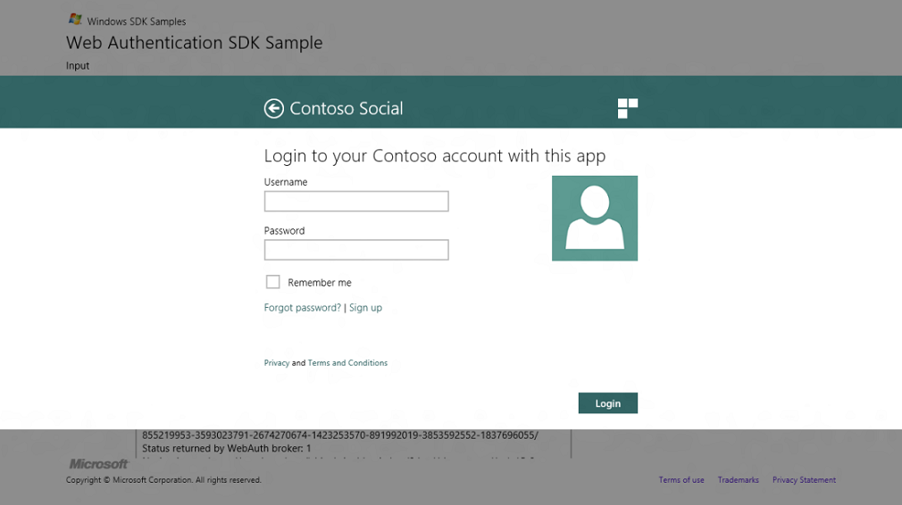

# Authentication for web pages

Authentication is proving who you are.

**Objective:** To have the web authentication broker appear as part of your app.

## Prerequisites

None

**Time to complete:** 15 minutes.

## Instructions

### 1. Getting started

Launch the setup file to install a Contoso website in Internet Information Services 8 on the local machine to host the sample HTML and CSS files.

1.  Sample HTML and CSS files will be installed to the program files directory under Microsoft\\Contoso.
2.  In addition a "Fabrikam Social"Windows Store app will be unpackaged to the desktop.

### 2. Getting familiar

To get a feel for what the sample pages look like in the Web Authentication Broker, open the Fabrikam Social Visual Studio 11 solution file in the "Fabrikam Social" folder on the desktop.

1.  Run the application and hit "Launch" to bring up the sample pages in the Web Authentication Broker.
2.  The app can be resized to one side or activated by sharing some data to the application.

### 3. Authentication

When the Web Auth API is invoked by the underlying app to connect to the provider, "Contoso Social", the login page is shown. This page is designed to be best at a fast and fluid login experience. It also provides entry points to some other common user actions such as retrieving password details, signing up for an account, and reading statements on privacy and terms and conditions that are completed in the browser. 

## Summary and next steps

Summary [Tutorial for authenticating web pages](tutorial-for-authenticating-web-pages.md)

Next [Authorization for web pages](authorization-for-web-pages.md)

## Related topics

<dl> <dt>

[Considerations for the web page development](considerations-for-the-web-page-development.md)
</dt> <dt>

[Web Authentication Broker SDK sample app](https://github.com/microsoft/Windows-universal-samples/tree/master/Samples/WebAuthenticationBroker)
</dt> <dt>

[**Windows.Security.Authentication.Web**](/uwp/api/Windows.Security.Authentication.Web)
</dt> </dl>

 

 
