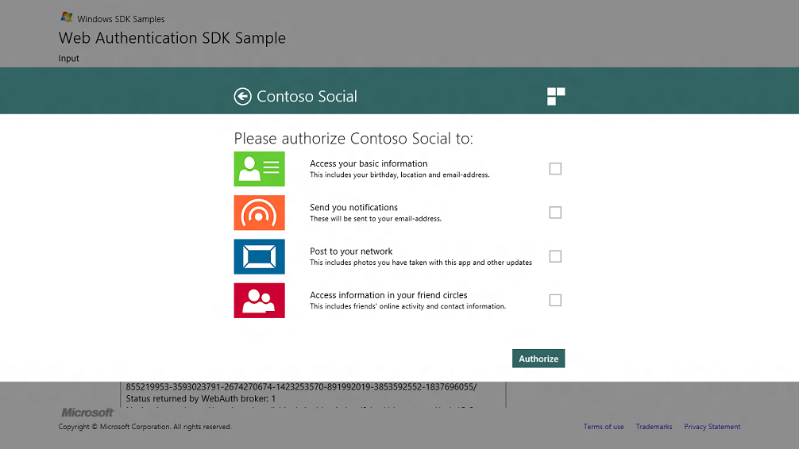

# Authorization for web pages

Authorization sets what resources you have access to.

**Objective:** To allow users access to your app.

## Prerequisites

None

**Time to complete:** 2 minutes.

## Instructions

### 1. Authorization

When the user enters their credentials and clicks the Login button, the permissions page is shown. This page is best at allowing users to control granular permissions in granting the app to access to Contoso’s data. 

### 2. How to use the sample

You need to know about the following HTML and CSS files.

1.  The following HTML files correspond to the two pages in the web authorization flow
    -   WebAuthLogin.html – sample HTML for the login page
    -   WebAuthPermissions.html – sample HTML for the permissions page
2.  The CSS files contain Windows 8 styles to help create a Windows Store app web page.
    -   ui-light.css – this has been derived from the base style sheet for Windows 8 controls.
    -   ui-webauth.css – this provides incremental styling for optimizing layout for web auth pages.
    -   theme-colors.css – this provides the incremental styling to override default accent colors of controls with the provider’s brand color.

## Summary and next steps

Summary [Tutorial for authenticating web pages](tutorial-for-authenticating-web-pages.md)

Next [Best practices for designing authentication web pages](best-practices-for-designing-authentication-web-pages.md)

## Related topics

<dl> <dt>

[Considerations for the web page development](considerations-for-the-web-page-development.md)
</dt> <dt>

[Web Authentication Broker SDK sample app](https://github.com/microsoft/Windows-universal-samples/tree/master/Samples/WebAuthenticationBroker)
</dt> <dt>

[**Windows.Security.Authentication.Web**](/uwp/api/Windows.Security.Authentication.Web)
</dt> </dl>

 

 
