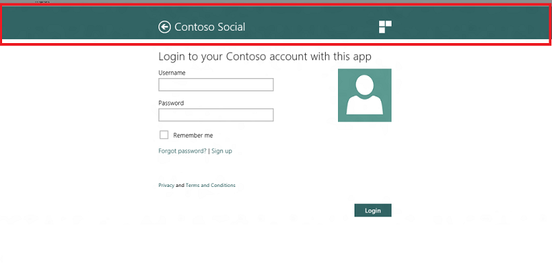

# Best Practices for designing authentication web pages

This topic describes best practices for designing web pages that use Web Authentication Broker for logging on.

-   [Use of metatags](#use-of-metatags)
-   [Use of Windows 8 CSS styling](#use-of-windows-8-css-styling)
-   [Use of color and themes](#use-of-color-and-themes)
-   [Alignment](#alignment)
-   [Designing for snap](#designing-for-snap)
-   [Designing for a fast and fluid login experience](#designing-for-a-fast-and-fluid-login-experience)
-   [Security Considerations](#security-considerations)
-   [Related topics](#related-topics)

## Use of metatags

Using metatags, the provider "Contoso Social" can specify the title, the icon and the color of the header. In the sample HTML file (WebAuthLogin.html), this is done by using the following code.


```HTML
<meta name="mswebdialog-title" content="Contoso Social" />
<meta name="mswebdialog-header-color" content="#326464" /> <!-- Your brand color -->
<meta name="mswebdialog-logo" content="contoso_social_glyph.png" />
```


This allows Windows to integrate the presence of the provider in a prominent way in the header of the UI as highlighted by the red box in the following screenshot. 

## Use of Windows 8 CSS styling

The provided ui-light.css stylesheet is the Windows 8 stylesheet used by Windows Store apps. It defines Windows Store app styling for typography and standard controls, like buttons, text boxes, hyperlinks, and check boxes to make sure they are touch friendly. When designing and tailoring web authorization pages for Windows 8, we encourage you to use this stylesheet as is and update it as needed as long as your web page still follows best-practices in its own way.

For example, if you have a special stylesheet for what hyperlinks should look and feel like on your web page, it's good to be thoughtful to make sure that the styling you provide is touch friendly in the same way as standard Windows 8 hyperlinks. This is essential for the consumer base using Windows 8 on their touch devices.

## Use of color and themes

This sample demonstrates a thoughtful use of color in a few different ways.

-   White background for the web page. As you can tell from the previous screenshot, the web page is hosted within a white surface that spans the width of the screen. To make sure that the web page integrates with the surface, it is advised that the web page should have a white background.
-   Colorizing controls based on your brand color. The CSS file theme-colors.css provides styling to override the standard colors of controls in the ui-light stylesheet to match the theming of the controls to the color of the header. For example, in the following screenshot, the buttons and hyperlinks take on colors derived from the header color. 
-   Header color. The use of Contoso's brand color in the header creates a unified personality for the provider's brand within the system UI.

## Alignment

The web page itself has no padding on the left or the right to allow for typographic alignment with the title in the header on the left and the icon in the header on the right.

You will also notice that buttons are always bottom-right aligned in the web page (and right aligned with the icon in the header). This is best-practice as Windows 8 users will be accustomed to similar dialog flows having buttons in the bottom-right.

## Designing for snap

In the following image, you can see the login and permissions pages in snap state.

 . 

In the sample file ui-webauth.css, you can see the use of media queries that optimize the layout of the page for snap state based on width available for the web page. The code snippet enclosed in the following scope implements CSS tailored for snap state.


```HTML
@media screen and (max-width: 500px) 
{
…
}
```


In Windows 8, the width of the snap state is 320 pixels. The web-auth page occupies 260 pixels in the UI above. We're using a max-width value with enough margin, so the media query code of the provider is not bound to the exact width of the snap state.

In tailoring your app for the snap view, it's important that user does not lose any context that they have in the other views of web auth experience (full, fill or charm views), but it's valuable to re-structure the layout and hierarchy of the elements in the page so that the information needed to retain context is visible and interactive. We've called out some examples of how the sample tailors the web page for the snap state.

-   As an example, for the login page in snap state, the width property of the input text field (as specified in ui-light.css) has been overridden and been set as smaller numerical value, so that the text field is not horizontally clipped.
-   As another example, in snap state, the font size of the h1 and h2 headers is reduced to 20 pt and 11 pt from 42 pt and 20 pt respectively. This is done in accordance with the Windows 8 type ramp, and optimizes text to be more compact in the changed viewport.
-   As another example, notice the sizes of the icons in the permissions page are smaller (compare to the full view page above). Again, this is done to retain context, while swapping design assets for those more optimal for the changed viewport.

## Designing for a fast and fluid login experience

Early in the designing of this web page, we made a stake in the ground that one thing that this page is best at is a fast and fluid login experience. Thus, the UI that is most prominent in the flow is the username and password field in the login page for a quick credential entry experience. While we identified that there are other common scenarios such as password retrieval, and referencing privacy statements, the rich experience of the web is a better place for those experiences. For all flows not related to secure web auth experience, we recommend navigating the user to the browser. This is shown in the sample HTML file (WebAuthLogin.html) as follows: `<meta name="mswebdialog-newwindowurl" content="*" />` This opens all web pages linked to from the login or permissions page in the user's default browser where the user can complete these flows and then return to the app to log in.

## Security Considerations

The following articles provide guidance for writing secure C++ code.

-   [Security Best Practices for C++](/cpp/security/security-best-practices-for-cpp)
-   [Patterns & Practices Security Guidance for Applications](/previous-versions/msp-n-p/ff650760(v=pandp.10))

## Related topics

<dl> <dt>

[Considerations for the web page development](considerations-for-the-web-page-development.md)
</dt> <dt>

[FAQ for Web Authentication Broker](faq-for-web-authentication-broker.md)
</dt> <dt>

[Web Authentication Broker SDK sample app](https://github.com/microsoft/Windows-universal-samples/tree/master/Samples/WebAuthenticationBroker)
</dt> <dt>

[**Windows.Security.Authentication.Web**](/uwp/api/Windows.Security.Authentication.Web)
</dt> </dl>

 

 
