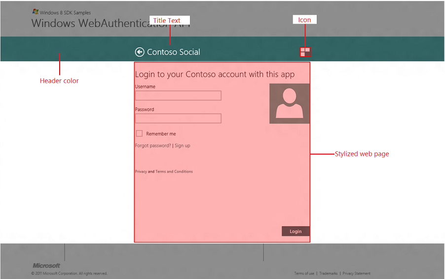

# How to customize the UI elements

A web page customizes the user interface (UI) with the title, icon, and header color by using metadata tags defined on the web page. Web developers can use HTML <meta> tags to display the provider's personality and brand in the Web Authentication Broker UI. In addition, developers can direct more intricate user actions, for example signing up and recovering passwords. The concept is very similar to Pinned Sites feature of the Windows Internet Explorer 9 and Windows 7.

In addition to customizing the user interface around the web page area, the web page should also take advantage of the Windows 8 controls’ styles, be enabled for touch, and enable links to be opened in the browser where appropriate.

The following is an example of a web page that has taken advantage of the Web Authentication Broker customization model. 

## Instructions

### Step 1: Customize the icon

The web page can provide an icon by using an mswebdialog-logo meta tag.

``` syntax
<meta name="mswebdialog-logo" content="https://www.contoso.com/logo.png"/>
```

The content is a URL that can be a page relative or absolute. The scheme of the URL can be HTTP or HTTPS. The format of the file should be either PNG or JPG. The size of the image should be 30x30 pixels. If the image is of the different size, it will be scaled down or up by the operating system to fit the 30x30 space. The image should be designed to render well when scaled up to 140% and 180% to account for higher resolution screens. To test different scaling factors, use the [Web Authentication Broker SDK sample app](https://github.com/microsoft/Windows-universal-samples/tree/master/Samples/WebAuthenticationBroker) loaded in Visual Studio 11 which allows simulating different resolutions and scaling factors using the Device windows of the Design mode.

### Step 2: Customize the title text

The web page can provide the title by using the mswebdialog-title meta tag.

``` syntax
<meta name="mswebdialog-title" content="Contoso Social"/>
```

The title should be short and should reflect the brand of the provider (for example, Contoso).

### Step 3: Customize the header color

The web page can provide the color that represents its brand identity to be used for the header of the dialog by using the mswebdialog-header-color meta tag.

``` syntax
<meta name="mswebdialog-header-color" content="#1267DF"/>
```

The color can be any value specified here. However, the Web Authentication Broker will ignore any alpha channel value. With this color specifically and with colors used on the page in general, it is recommended to follow the same colors used in provider’s Windows 8 app if such app exists.

> [!Note]  
> Icons and colors are cached per server on the client once META tags are parsed. Clear the client cache before launching the UI in order for the changes to take effect. To do so, modify the following registry settings.

 

``` syntax
// Registry location under HKLM used for setting various AuthHost parameters.
#define AUTH_HOST_LOCAL_MACHINE_REGPATH \
    L"SOFTWARE\\Microsoft\\Windows NT\\CurrentVersion\\Image File Execution Options\\authhost.exe"
// MaxAge to use for downloading logo images
#define AUTH_HOST_LOGO_IMAGE_MAX_AGE_SECONDS_REG_VALUE_NAME \
    L"LogoImageMaxAgeSeconds"
// 24 hours
#define AUTH_HOST_LOGO_IMAGE_MAX_AGE_SECONDS_DEFAULT        \
    (24 * 60 * 60)
```

Once an icon is downloaded it is not picked up again for 24 hours. In order to test with logo images, set the reg key above with a lower value.

### Step 4: Customize the web page

In addition to customizing the UI around the web page, developers should also create web pages that are seamless and integrated with the overall Windows 8 experience. This includes using recommended styles, making sure web pages work great with touch enabled devices, and open certain web pages in the web browser.

-   Styling

    It is strongly encouraged to use the styling recommended here to create a more consistent user experience across Web Authentication Broker web pages and other UI components of Windows 8. The web page should use a white background and no borders. The buttons such as Login or Cancel should be positioned at the right bottom corner and use the same color as the header. Finally, since Web Authentication Broker provides a Back button, consider eliminating a Cancel button from the web page completely.

-   Enabling touch

    The web page should be designed with a touch-based user interaction in mind. For more information about designing for touch in Windows 8, see the [Touch interaction design](https://msdn.microsoft.com/library/Hh465415(v=Win.10).aspx) topic.

-   Customizing target of the hyperlinks

    Web Authentication Broker is great for delivering web pages that require a single user action such as logon or OAuth authorization pages. However, for more intricate user flows such as account creation, recovering from a lost or forgotten password, showing privacy statements and so on, where the user is expected to invest some time in understanding and completing the flow, it is recommended that these pages be launched in the user’s preferred browser to support full-navigation and reach browsing. Web Authentication Broker by default doesn’t allow new browser windows to be opened from a web page (see section No New windows By Default for more details). However, by using the meta tag `mswebdialog-newwindowurl` the web page can declare which URLs should be opened in the browser.

    The `mswebdialog-newwindowurl` allows the web page to specify a URL or part of the URL that the Web Authentication Broker will use to match (left-hand string match) against every time it is asked to open a URL in a new window either by using the target attribute or window.open() method. If there is a match, the URL will be opened in the user’s default browser. If there is no match, the Web Authentication Broker will navigate to the URL itself (default behavior). For example:`<meta name="mswebdialog-newwindowurl" content="https://www.contoso.com/privacy"/>`

    In the case of this meta tag, the Web Authentication Broker will open the https://www.contoso.com/privacy/policy.html in the browser, but will directly navigate to https://www.contoso.com/termsofuse.html. Note that links that don’t attempt to open in a new window (for example, links that are not using target attribute or window.open() method) are not affected by this meta tag. The content is a URL that can be a page relative or absolute. The scheme of the URL can be HTTP or HTTPS. You should define `mswebdialog-newwindowurl` meta tags to cover any links that are not part of the core user flow such as privacy statements, sign up forms, and such. If you support login with a third-party authentication provider (for example, OpenID providers), make sure to keep those interactions within the Web Authentication Broker. To enable all links on your page as safe to be opened in the browser, use the star syntax, such as, `  <meta name="mswebdialog-newwindowurl" content="*"/>` Note that the “\*” can only be used exclusively and can’t be combined with another URL, for example, "https://www.contoso.com/\*" is not a valid syntax.

### Step 5: Rules applied to all meta tags

When Web Authentication Broker processes meta tags, the following rules apply:

-   The effect of the meta tag will persist across all pages under same second level domain (for example, contoso.com) unless another meta tag of the same name but different content is encountered.
-   If multiple meta tags of the same name are encountered on the same page, the Web Authentication Broker will choose only one of them and ignore the rest. Which specific meta tag is chosen is undefined.
    > [!Note]  
    > This rule does not apply to the `mswebdialog-newwindowurl` meta tag that allows multiple instances on the same page.

     

## Related topics

<dl> <dt>

[Considerations for the web page development](considerations-for-the-web-page-development.md)
</dt> <dt>

[Web Authentication Broker SDK sample app](https://github.com/microsoft/Windows-universal-samples/tree/master/Samples/WebAuthenticationBroker)
</dt> <dt>

[**Windows.Security.Authentication.Web**](/uwp/api/Windows.Security.Authentication.Web)
</dt> </dl>

 

 
