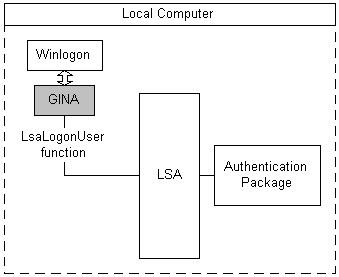

# Interactive Authentication

Authentication is interactive when a user is prompted to supply logon information. The [*Local Security Authority*](../secgloss/l-gly.md) (LSA) performs an interactive authentication when a user logs on through the [*GINA*](../secgloss/g-gly.md) user interface. The following illustration shows the parts of a typical interactive authentication.

A user signals the system to begin the logon sequence by typing the CTRL+ALT+DEL [*secure attention sequence*](../secgloss/s-gly.md) (SAS). [*Winlogon*](../secgloss/w-gly.md) receives the SAS and calls the GINA to display a user interface and obtain the user's logon data, such as a user name and password.

After obtaining the logon data, the GINA calls the [**LsaLogonUser**](/windows/desktop/api/Ntsecapi/nf-ntsecapi-lsalogonuser) function to authenticate the user, specifying which authentication package must be used to evaluate the logon data.

The LSA calls the specified authentication package and passes the logon data to it. The authentication package examines the data and determines whether the authentication is successful. The authentication result is returned to the LSA and from the LSA, to the GINA.

The GINA displays the success or failure of the authentication to the user and returns the result of the authentication to Winlogon. If the authentication succeeds, the user's logon session begins and a set of logon [*credentials*](../secgloss/c-gly.md) are saved for future reference.

> [!Note]  
> In general, a developer who writes a custom GINA to accept specialized logon data, such as a [*smart card*](../secgloss/s-gly.md) or retinal-scan data, must also write an authentication package responsible for processing that data and determining its authenticity.

 

For more information about Winlogon and GINAs, see [Winlogon and GINA](winlogon-and-gina.md). For more information about authentication packages, see [Creating Custom Security Packages](creating-custom-security-packages.md).

 

 
