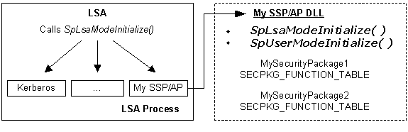
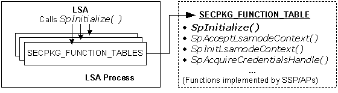

# LSA Mode Initialization

When the computer system is started, the [*Local Security Authority*](../secgloss/l-gly.md) (LSA) automatically loads all registered [*security support provider*](../secgloss/s-gly.md)/[*authentication package*](../secgloss/a-gly.md) (SSP/AP) DLLs into its process space. The following illustrations show the initialization process.

> [!Note]  
> "Kerberos" represents the Microsoft [*Kerberos*](../secgloss/k-gly.md) SSP/AP, and "My SSP/AP" represents a custom SSP/AP that contains two custom security packages.

 

At startup, the LSA calls the [**SpLsaModeInitialize**](/windows/desktop/api/Ntsecpkg/nc-ntsecpkg-splsamodeinitializefn) function in each SSP/AP to obtain pointers to the functions implemented by each [*security package*](../secgloss/s-gly.md) in the DLL. The function pointers are passed to the LSA in an array of [**SECPKG\_FUNCTION\_TABLE**](/windows/desktop/api/Ntsecpkg/ns-ntsecpkg-secpkg_function_table) structures.

After receiving the set of [**SECPKG\_FUNCTION\_TABLE**](/windows/desktop/api/Ntsecpkg/ns-ntsecpkg-secpkg_function_table) structures, the LSA calls each security package's [**SpInitialize**](/windows/desktop/api/Ntsecpkg/nc-ntsecpkg-spinitializefn) function. The LSA uses this function call to pass each security package an [**LSA\_SECPKG\_FUNCTION\_TABLE**](/windows/desktop/api/Ntsecpkg/ns-ntsecpkg-lsa_secpkg_function_table) structure, which contains pointers to the LSA support functions available to security packages. In addition to storing the pointers to the LSA support functions, custom security packages should use their implementation of the **SpInitialize** function to perform any initialization-related processing.

For a list of the LSA support functions available to LSA-mode security packages, see [LSA Functions Called by SSP/APs](authentication-functions.md).

For information about registering an SSP/AP DLL, see [Registering SSP/AP DLLs](registering-ssp-ap-dlls.md).

 

 
