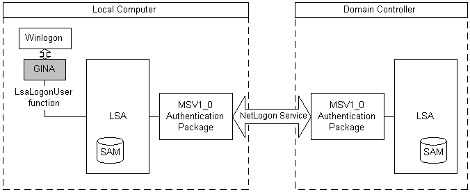

# MSV1\_0 Authentication Package

Microsoft provides the MSV1\_0 [*authentication package*](../secgloss/a-gly.md) for local machine logons that do not require custom authentication. The [*Local Security Authority*](../secgloss/l-gly.md) (LSA) calls the MSV1\_0 authentication package to process logon data collected by the [*GINA*](../secgloss/g-gly.md) for the [*Winlogon*](../secgloss/w-gly.md) logon process. The MSV1\_0 package checks the local security accounts manager (SAM) database to determine whether the logon data belongs to a valid [*security principal*](../secgloss/s-gly.md) and then returns the result of the logon attempt to the LSA.

MSV1\_0 also supports domain logons. MSV1\_0 processes domain logons using pass-through authentication, as illustrated in the following diagram.

In pass-through authentication, the local instance of MSV1\_0 uses the Netlogon service to call the instance of MSV1\_0 running on the domain controller. The domain controller's instance of MSV1\_0 then checks the SAM database of the domain controller and returns the logon result to the instance of MSV1\_0 on the local machine. The local version of MSV1\_0 forwards the logon result to the instance of the LSA on the local machine.

If the domain controller is not available, and the LSA contains cached [*credentials*](../secgloss/c-gly.md) for the user, the local instance of MSV1\_0 can authenticate the user using the cached logon data.

The MSV1\_0 authentication package also supports [subauthentication packages](subauthentication-packages.md). A subauthentication package is a DLL that can replace part of the authentication and validation criteria used by the MSV1\_0 authentication package.

The MSV1\_0 authentication package defines a [*primary credentials*](../secgloss/p-gly.md) key/string value pair. The primary credentials string holds the credentials derived from the data provided at logon time. It includes the user name and both case-sensitive and case-insensitive forms of the user's password.

 

 
