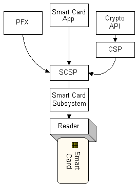

# Relation to Other Services

Other parts of the Microsoft Internet Security Framework use the [*smart card subsystem*](security.s_gly#-security-smart-card-subsystem-gly), as shown in the following illustration. (Because of U.S. export restrictions, a [*cryptographic service provider*](security.c_gly#-security-cryptographic-service-provider-gly) (CSP) that uses an SCSP to communicate cryptographic-related requests should sign and verify the SCSP.)

For more information on the role of the smart card subsystem in the Microsoft Internet Security Framework, see [http://www.microsoft.com/whdc/device/input/smartcard/default.mspx](http://go.microsoft.com/fwlink/p/?linkid=84133).

 

 

