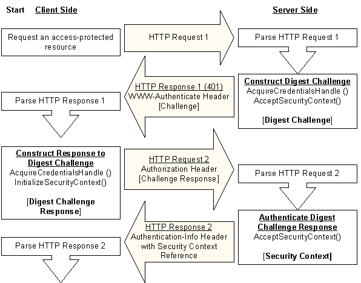

# The Digest Access Protocol

The Digest Access protocol specified by [RFC 2617](https://www.ietf.org/rfc/rfc2617.txt) is implemented by the Microsoft Digest [*security support provider*](../secgloss/s-gly.md) (SSP). The implementation consists of a set of [Microsoft Security Support Provider Interface](sspi.md) (SSPI) security context functions that client/server applications call to:

-   Establish a [*security context*](../secgloss/s-gly.md) for message exchange.
-   Obtain data objects required by the Digest SSP, such as [*credentials*](../secgloss/c-gly.md) and context handles.
-   Access message [*integrity*](../secgloss/i-gly.md) and confidentiality mechanisms.

Digest Access authentication takes place within paired request/response transactions, with requests originating on the client and responses originating on the server. A successful Digest Access authentication requires two request/response pairs.

When the Digest SSP is used for HTTP authentication, there is no connection maintained between the first and second request/response pair. In other words, the server does not wait for the second request after it sends the first response.

The following illustration shows the steps taken on the HTTP path by a client and server to complete an authentication using the Digest SSP. The SASL mechanism makes use of mutual authentication, so authentication data is sent back on the final ASC server call to the client that verifies that the client is communicating with the correct server.

The process starts with the client requesting an access-protected resource from the server by sending HTTP Request 1.

The server receives HTTP Request 1 and determines that the resource requires authentication information that was not included in the request. The server generates a challenge for the client as follows:

1.  The server obtains its [*credentials*](../secgloss/c-gly.md) by calling the [**AcquireCredentialsHandle**](/windows/win32/api/sspi/nf-sspi-acquirecredentialshandlea) function.
2.  The server generates the Digest challenge by calling the [**AcceptSecurityContext (General)**](/windows/win32/api/sspi/nf-sspi-acceptsecuritycontext) function.
3.  The server sends a WWW-Authenticate header as its response to the client's request (shown as HTTP Response 1). The header contains the Digest challenge and an opaque directive that contains a reference to a partial [*security context*](../secgloss/s-gly.md) established for the client. The header is sent with a 401 status code that indicates that the client request generated an unauthorized access error. For more information about the Digest challenge, see [Contents of a Digest Challenge](contents-of-a-digest-challenge.md) and [Generating the Digest Challenge](generating-the-digest-challenge.md).
4.  The client receives HTTP Response 1, extracts the Digest challenge sent by the server, and generates a Digest challenge response as follows:
    1.  The user's credentials are obtained either by calling the [**AcquireCredentialsHandle**](/windows/win32/api/sspi/nf-sspi-acquirecredentialshandlea) function or by interactively prompting the user for credentials.
    2.  The challenge and credentials information are passed to the [**InitializeSecurityContext (General)**](/windows/win32/api/sspi/nf-sspi-initializesecuritycontexta) function, which generates the Digest challenge response.
5.  The client sends an Authorization header that contains the challenge response to the server (shown as HTTP Request 2). For more information about the Digest challenge response, see [Contents of a Digest Challenge Response](contents-of-a-digest-challenge-response.md) and [Generating the Digest Challenge Response](generating-the-digest-challenge-response.md).
6.  The server receives HTTP Request 2, extracts the challenge response sent by the client, and authenticates the information by calling the [**AcceptSecurityContext (General)**](/windows/win32/api/sspi/nf-sspi-acceptsecuritycontext) function. For details about the authentication process, see [Initial Authentication using Microsoft Digest](initial-authentication-using-microsoft-digest.md).
7.  The server sends HTTP Response 2 back to the client as the second and final response required by the Digest Access protocol. If the authentication is successful, this response contains the requested resource.

## Related topics

<dl> <dt>

[Contents of a Digest Challenge Response](contents-of-a-digest-challenge-response.md)
</dt> </dl>

 

 
