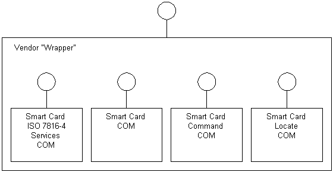

# Vendor Wrapper Service Provider

The purpose of the vendor wrapper is to encapsulate and use the low-level COM interfaces (supplied by the smart card manufacturers) for a particular smart card. These interfaces are not supplied by Microsoft.

As described in part 6 of the *Interoperability Specification for ICCs and Personal Computer Systems* (see specifications at [https://pcscworkgroup.com](https://pcscworkgroup.com/)), the functionality exposed by this wrapper is easier to use than the functionality of four separate service providers. The wrapper's functionality can be divided into four main areas:

-   Smart card authentication services, such as get challenge and card authentication.
-   Smart card file access or file system services, such as open, close, read, and write.
-   Smart card management, such as attach and detach.
-   Smart card verification services, such as verify and change code.

> [!Note]  
> This specification may not be available in some languages and countries or regions.

 

The functionality is specific to the type of card being used (which functions the card supports, protocols, and so on) and will be different for each card.

The Microsoft SCardCOM example wrapper uses the ATL COM library to implement a simple wrapper and lay down a template for other wrappers. It implements the following interfaces.

| Interface or object                                     | Description                         |
|---------------------------------------------------------|-------------------------------------|
| [**ISCardAuth**](iscardauth.md)              | Authentication services.  |
| [**ISCardFileAccess**](iscardfileaccess.md)  | File system services.     |
| [**ISCardManage**](iscardmanage.md)          | Management services.      |
| [**ISCardVerify**](iscardverify.md)          | Verification services.    |

 

> [!Note]  
> The SCardCOM example is provided only as an example of implementing the wrapper interfaces. To prevent DLL name collision with other vendors, you must not use SCardCOM.dll as the name of any DLLs you create.

 

Following is a typical use of the vendor wrapper. This example uses the [**ISCardManage**](iscardmanage.md) interface to create instances of the interfaces that will be wrapped into the service provider and the [**ISCardVerify**](iscardverify.md) interface to verify their operation.

**To build a wrapper service provider**

1.  Create an instance of the [**ISCardManage**](iscardmanage.md) interface. Use this interface to create an instance of required interfaces (for example, [**ISCardFileAccess**](iscardfileaccess.md) or [**ISCardVerify**](iscardverify.md)). When creating these interfaces, any corresponding low-level COM interfaces would also be created.
2.  Attach/connect to a card through the appropriate [**ISCardManage**](iscardmanage.md) method.
3.  Perform required operations through the appropriate [**ISCardVerify**](iscardverify.md) method (which may call multiple low-level COM interfaces and methods to complete).
4.  Repeat for other operations.
5.  Release when complete.

The COM interface name and interface identifier (GUID) should not change from those used in the code or example wrapper. However, the class GUID (that is, where an actual implementation of an interface resides) must be changed from those used. This is especially important when implementing a vendor wrapper. One example would be using multiple vendor wrappers on a particular computer. These wrappers should implement the same COM interfaces, but will always use different implementation strategies. Therefore, different classes (and class IDs) are required.

 

 

