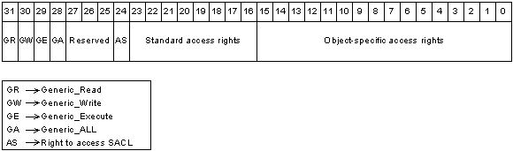

# Access Mask Format

All securable objects arrange their access rights by using the [*access mask*](/windows/desktop/SecGloss/a-gly) format shown in the following illustration.

In this format, the low-order 16 bits are for object-specific access rights, the next 8 bits are for [standard access rights](standard-access-rights.md), which apply to most types of objects, and the 4 high-order bits are used to specify [generic access rights](generic-access-rights.md) that each object type can map to a set of standard and object-specific rights. The ACCESS\_SYSTEM\_SECURITY bit corresponds to the [right to access the object's SACL](sacl-access-right.md).

 

 
