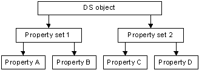

# ACEs to Control Access to an Object's Properties

The [*discretionary access control list*](/windows/desktop/SecGloss/d-gly) (DACL) of a directory service (DS) object can contain a hierarchy of [*access control entries*](/windows/desktop/SecGloss/a-gly) (ACEs), as follows:

1.  ACEs that protect the object itself
2.  [Object-specific ACEs](object-specific-aces.md) that protect a specified property set on the object
3.  Object-specific ACEs that protect a specified property on the object

Within this hierarchy, the rights granted or denied at a higher level apply also to the lower levels. For example, if an object-specific ACE on a property set allows a trustee the ADS\_RIGHT\_DS\_READ\_PROP right, the trustee has implicit read access to all of the properties of that property set. Similarly, an ACE on the object itself that allows ADS\_RIGHT\_DS\_READ\_PROP access gives the trustee read access to all of the object's properties.

The following illustration shows the tree of a hypothetical DS object and its property sets and properties.

Suppose you want to allow the following access to the properties of this DS object:

-   Allow Group A read/write permission to all of the object's properties
-   Allow everyone else read/write permission to all properties except Property D

To do this, set the ACEs in the object's DACL as shown in the following table.

| Trustee  | Object GUID    | ACE type                  | Access rights                                             |
|----------|----------------|---------------------------|-----------------------------------------------------------|
| Group A  | None           | Access-allowed ACE        | ADS\_RIGHT\_DS\_READ\_PROP \| ADS\_RIGHT\_DS\_WRITE\_PROP |
| Everyone | Property Set 1 | Access-allowed object ACE | ADS\_RIGHT\_DS\_READ\_PROP \| ADS\_RIGHT\_DS\_WRITE\_PROP |
| Everyone | Property C     | Access-allowed object ACE | ADS\_RIGHT\_DS\_READ\_PROP \| ADS\_RIGHT\_DS\_WRITE\_PROP |

 

The ACE for Group A does not have an object GUID, which means that it allows access to all the object's properties. The object-specific ACE for Property Set 1 allows everyone access to Properties A and B. The other object-specific ACE allows everyone access to Property C. Note that although this DACL does not have any access-denied ACEs, it implicitly denies Property D access to everyone except Group A.

When a user tries to access an object's property, the system checks the ACEs, in order, until the requested access is explicitly granted, denied, or there are no more ACEs, in which case, access is implicitly denied.

The system evaluates:

-   ACEs that apply to the object itself
-   Object-specific ACEs that apply to the property set that contains the property being accessed
-   Object-specific ACEs that apply to the property being accessed

The system ignores object-specific ACEs that apply to other property sets or properties.

 

 
