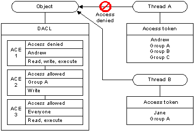

# DACLs and ACEs

If a Windows object does not have a [*discretionary access control list*](/windows/desktop/SecGloss/d-gly) (DACL), the system allows everyone full access to it. If an object has a DACL, the system allows only the access that is explicitly allowed by the [*access control entries*](/windows/desktop/SecGloss/a-gly) (ACEs) in the DACL. If there are no ACEs in the DACL, the system does not allow access to anyone. Similarly, if a DACL has ACEs that allow access to a limited set of users or groups, the system implicitly denies access to all trustees not included in the ACEs.

In most cases, you can control access to an object by using access-allowed ACEs; you do not need to explicitly deny access to an object. The exception is when an ACE allows access to a group and you want to deny access to a member of the group. To do this, place an access-denied ACE for the user in the DACL ahead of the access-allowed ACE for the group. Note that the [order of the ACEs](order-of-aces-in-a-dacl.md) is important because the system reads the ACEs in sequence until access is granted or denied. The user's access-denied ACE must appear first; otherwise, when the system reads the group's access allowed ACE, it will grant access to the restricted user.

The following illustration shows a DACL that denies access to one user and grants access to two groups. The members of Group A get Read, Write, and Execute access rights by accumulating the rights allowed to Group A and rights allowed to Everyone. The exception is Andrew, who is denied access by the access-denied ACE in spite of being a member of the Everyone Group.

 

 
