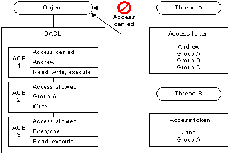

# How AccessCheck Works

When a thread tries to access a securable object, the system either grants or denies access. If the object does not have a [*discretionary access control list*](/windows/desktop/SecGloss/d-gly) (DACL), the system grants access; otherwise, the system looks for [Access Control Entries](access-control-entries.md) (ACEs) in the object's DACL that apply to the thread. Each ACE in the object's DACL specifies the access rights allowed or denied for a [trustee](trustees.md), which can be a user account, a group account, or a [*logon session*](/windows/desktop/SecGloss/l-gly).

## DACLs

The system compares the trustee in each ACE to the trustees identified in the thread's [access token](access-tokens.md). An access token contains [*security identifiers*](/windows/desktop/SecGloss/s-gly) (SIDs) that identify the user and the group accounts to which the user belongs. A token also contains a [*logon SID*](/windows/desktop/SecGloss/l-gly) that identifies the current logon session. During an access check, the system ignores group SIDs that are not enabled. For more information on enabled, disabled, and deny-only SIDs, see [SID Attributes in an Access Token](sid-attributes-in-an-access-token.md).

Typically, the system uses the [*primary access token*](/windows/desktop/SecGloss/p-gly) of the thread that is requesting access. However, if the thread is impersonating another user, the system uses the thread's [*impersonation token*](/windows/desktop/SecGloss/i-gly).

The system examines each ACE in sequence until one of the following events occurs:

-   An access-denied ACE explicitly denies any of the requested [access rights](access-rights-and-access-masks.md) to one of the trustees listed in the thread's access token.
-   One or more access-allowed ACEs for trustees listed in the thread's access token explicitly grant all the requested access rights.
-   All ACEs have been checked and there is still at least one requested access right that has not been explicitly allowed, in which case, access is implicitly denied.

The following illustration shows how an object's DACL can allow access to one thread while denying access to another.

For Thread A, the system reads ACE 1 and immediately denies access because the access-denied ACE applies to the user in the thread's access token. In this case, the system does not check ACEs 2 and 3. For Thread B, ACE 1 does not apply, so the system proceeds to ACE 2, which allows write access, and ACE 3 which allows read and execute access.

Because the system stops checking ACEs when the requested access is explicitly granted or denied, the order of ACEs in a DACL is important. Note that if the ACE order were different in the example, the system might have granted access to Thread A. For system objects, the operating system defines a preferred [order of ACEs in a DACL](order-of-aces-in-a-dacl.md).

 

 
