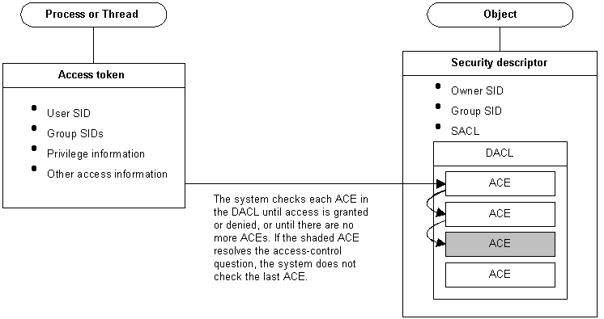

# Interaction Between Threads and Securable Objects

When a thread attempts to use a [securable object](securable-objects.md), the system performs an access check before allowing the thread to proceed. In an access check, the system compares the security information in the thread's [*access token*](/windows/desktop/SecGloss/a-gly) against the security information in the object's [*security descriptor*](/windows/desktop/SecGloss/s-gly).

-   The access token contains [*security identifiers*](/windows/desktop/SecGloss/s-gly) (SIDs) that identify the user associated with the thread.
-   The security descriptor identifies the object's owner and contains a [*discretionary access control list*](/windows/desktop/SecGloss/d-gly) (DACL). The DACL contains [*access control entries*](/windows/desktop/SecGloss/a-gly) (ACEs), each of which specify the access rights allowed or denied to a specific user or group.

The system checks the object's DACL, looking for ACEs that apply to the user and group SIDs from the thread's access token. The system checks each ACE until access is either granted or denied or until there are no more ACEs to check. Conceivably, an [*access control list*](/windows/desktop/SecGloss/a-gly) (ACL) could have several ACEs that apply to the token's SIDs. And, if this occurs, the access rights granted by each ACE accumulate. For example, if one ACE grants read access to a group and another ACE grants write access to a user who is a member of the group, the user can have both read and write access to the object.

The following illustration shows the relationship between these blocks of security information:

 

 
