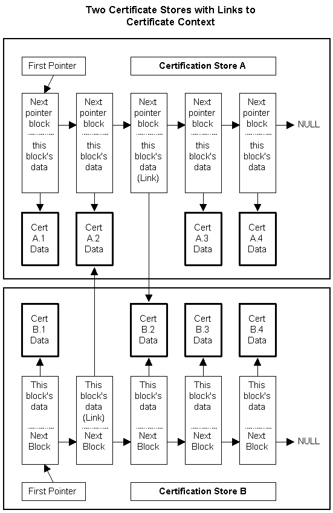

# Certificate Links

The functions [**CertAddCertificateLinkToStore**](/windows/desktop/api/Wincrypt/nf-wincrypt-certaddcertificatelinktostore), [**CertAddCRLLinkToStore**](/windows/desktop/api/Wincrypt/nf-wincrypt-certaddcrllinktostore), and [**CertAddCTLLinkToStore**](/windows/desktop/api/Wincrypt/nf-wincrypt-certaddctllinktostore) add links to existing contexts into [*certificate stores*](../secgloss/c-gly.md) rather than adding copies of those contexts. Adding links to stores makes the same physical [*certificate*](../secgloss/c-gly.md), [*CRL*](../secgloss/c-gly.md), or [*CTL*](../secgloss/c-gly.md) available through several different stores. Changes made to the extended properties of a [*context*](../secgloss/c-gly.md) from the store of the original context, or from a store where a link to that context is stored, are available in the store that holds the original context and in all other stores that have links to that context.

For an example that uses [**CertAddCertificateLinkToStore**](/windows/desktop/api/Wincrypt/nf-wincrypt-certaddcertificatelinktostore), see [Example C Program: Certificate Store Operations](example-c-program-certificate-store-operations.md).

Assume that certificates A.1, A.2, A.3, and A.4 are originally in store A, and certificates B.1, B.2, B.3, and B.4 are originally in store B.

-   The diagram shows a link added in store B to certificate A.2 and a link added in store A to certificate B.2.
-   The original of certificate A.2 is still in store A. The original of B.2 is still in store B.
-   Any changes made to the extended properties of certificate A.2 or certificate B.2 from either store A or store B will be available to both stores.
-   If a copy of certificate A.3 were made and stored in store B, any changes to the extended properties of the original A.3 certificate made from store A would not be visible in the new copy in store B. If changes were made to the extended properties of the copy of certificate A.3 in store B, those changes would not affect the contents of the original A.3 certificate and would not be visible from store A.

 

 
