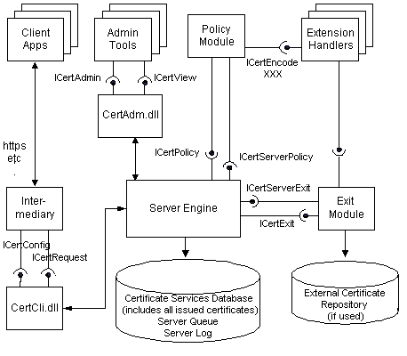

# Certificate Services Architecture

Certificate Services is a development platform for building Certification Authorities for enterprises or secure Internet applications. A configured and operational certification authority will allow a site to issue, track, manage, and revoke certificates with minimal administration overhead and maximal security.

The Certificate Services consists of the server engine, the server database, and a set of modules and tools that work together to function as a certification authority. External applications, modules, and administration tools use Component Object Model (COM) interfaces to interact with the server engine. The following diagram shows the interfaces used by the server engine:

An operational certification system will typically have four major subsystems.

| Subsystem             | Description                                                                                                                                                                                                                                                                                                                                                                                                                                                                                                                                                                                                                                                                                                     |
|-----------------------|-----------------------------------------------------------------------------------------------------------------------------------------------------------------------------------------------------------------------------------------------------------------------------------------------------------------------------------------------------------------------------------------------------------------------------------------------------------------------------------------------------------------------------------------------------------------------------------------------------------------------------------------------------------------------------------------------------------------|
| Client                | The client is the software that is used by the end user to generate a [*certificate request*](../secgloss/c-gly.md), send the request, and receive the finished certificate. An example of a client is Microsoft Internet Explorer version 5. The client will typically interact with a custom interface maintained by the intermediary application.                                                                                                                                                                                                                                                                                              |
| Intermediary          | The intermediary is a subsystem that consists of the intermediary application and the Certificate Services client interface (*Certificate Services Web Client* in the setup program). The intermediary application interacts directly with the client, receiving certificate requests and returning finished certificates. It communicates with the server engine through the Certificate Services client interface, which contains the [**ICertConfig**](/windows/desktop/api/Certcli/nn-certcli-icertconfig) and [**ICertRequest**](/windows/desktop/api/Certcli/nn-certcli-icertrequest) COM interfaces. An example of an intermediary application is Microsoft Internet Information Services. The intermediary application can be implemented entirely through Active Server Pages. |
| Server                | The server is the system that builds the certificate. In addition to the server engine, two configurable components are included; the policy module and the exit module. The policy module interacts with the server engine through the [**ICertPolicy**](/windows/desktop/api/Certpol/nn-certpol-icertpolicy) and [**ICertServerPolicy**](/windows/desktop/api/Certif/nn-certif-icertserverpolicy) interfaces. Exit modules (there can be more than one) interact with the server engine through the [**ICertExit**](/windows/desktop/api/Certexit/nn-certexit-icertexit) and [**ICertServerExit**](/windows/desktop/api/Certif/nn-certif-icertserverexit) interfaces.                                                                                                                                                                                       |
| Administrative Client | The administrative client is the system that monitors and manages certificates and requests. The administrative client uses the [**ICertAdmin**](/windows/desktop/api/Certadm/nn-certadm-icertadmin) interface to communicate with the server engine.                                                                                                                                                                                                                                                                                                                                                                                                                                                                                               |

 

For more information about Certificate Services architecture, see [Cryptography Interfaces](cryptography-interfaces.md), [Building a Certificate](building-a-certificate.md), and the following topics.

| Section                                      | Content                                                                                                                                                                                                                                                                    |
|----------------------------------------------|----------------------------------------------------------------------------------------------------------------------------------------------------------------------------------------------------------------------------------------------------------------------------|
| [Policy Modules](policy-modules.md)         | Customizable programs that can be used during the evaluation of [*certificate requests*](../secgloss/c-gly.md); these programs enforce the rules by which Certificate Services issues or denies the request. |
| [Exit Modules](exit-modules.md)             | Customizable programs that receive notifications from the server engine when operations occur, such as when a certificate is issued.                                                                                                                                       |
| [Extension Handlers](extension-handlers.md) | COM objects that provide routines for encoding the more complex extensions and data types.                                                                                                                                                                                 |
| [Intermediaries](intermediaries.md)         | Programs that communicate with client applications to allow the submitting of certificate requests.                                                                                                                                                                        |

 

 

 
