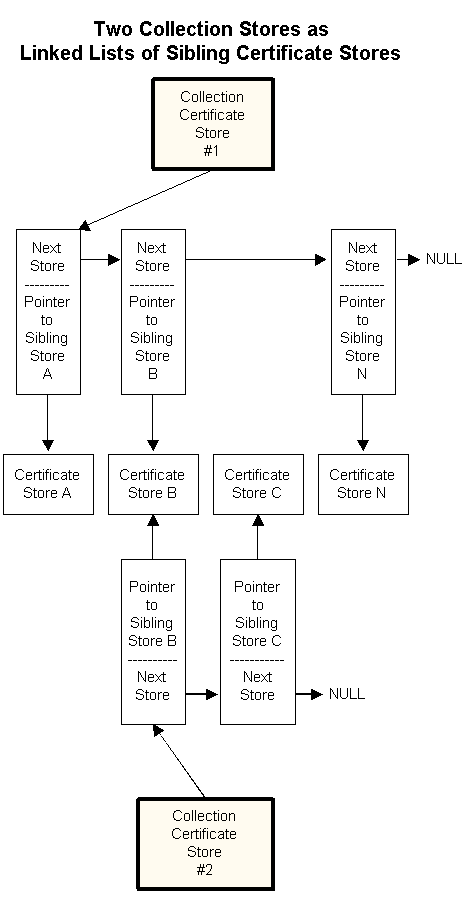

# Collection Stores

As the number of [*certificates*](../secgloss/c-gly.md), [*certificate revocation lists*](../secgloss/c-gly.md) (CRLs), and [*certificate trust list*](../secgloss/c-gly.md) (CTLs) in a user's collection grows, the organization of those certificates becomes an issue. One possible solution is to create separate certificate stores to keep different kinds of certificates. This solution creates a new problem because an application might need to search several different stores to find a specific certificate. The use of logical or collection stores solves this problem.

A [*logical store*](../secgloss/l-gly.md) and a collection certificate store are groups of physical stores that appears to an application as a single store. All member stores of a logical or collection store can be searched or enumerated with a single function call to either [**CertFindCertificateInStore**](/windows/desktop/api/Wincrypt/nf-wincrypt-certfindcertificateinstore) or [**CertEnumCertificatesInStore**](/windows/desktop/api/Wincrypt/nf-wincrypt-certenumcertificatesinstore).

The use of logical or collection stores also provides flexibility that is difficult to achieve with paper records. A certificate in a single physical store might need to be a member of several different logical groups. Therefore, an individual physical store can be a member of more than one logical or collection store as shown in the following illustration.

This illustration presents the following basic, logical certificate store concepts:

-   A collection certificate store has a pointer to the first pointer block for that collection store.
-   Each pointer block of a collection store has a pointer to a sibling store and a pointer to the next pointer block of the collection.
-   Each sibling store in a collection is a simple physical certificate store.
-   A simple certificate store can be a member sibling store in many different collection stores.
-   Certificates added to a collection store are physically added to one of the sibling stores in the collection.
-   Certificates in a sibling store can be accessed by any collection store in which the sibling store is a member.

Collection stores are built within an application by opening a collection store by using [**CertOpenStore**](/windows/desktop/api/Wincrypt/nf-wincrypt-certopenstore) and then using [**CertAddStoreToCollection**](/windows/desktop/api/Wincrypt/nf-wincrypt-certaddstoretocollection) to add an open sibling store to the collection store. A sibling store can be deleted from a collection store by calling [**CertRemoveStoreFromCollection**](/windows/desktop/api/Wincrypt/nf-wincrypt-certremovestorefromcollection).

 

 
