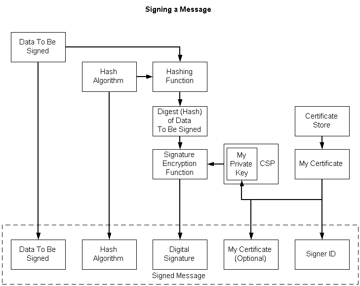

# Creating a Signed Message

The following illustration depicts the tasks that must be accomplished to create a signed message. The steps are listed following the illustration.

**To create a signed message**

1.  Create the data (if necessary) and get a pointer to it.
2.  Open a [*certificate store*](../secgloss/c-gly.md) that contains the signer's certificate.
3.  Get the [*private key*](../secgloss/p-gly.md) for the certificate. A property must be set on the certificate before using it, to tie a certificate to a particular [*CSP*](../secgloss/c-gly.md), and, within that CSP, to a particular private key. This needs to be set once.
4.  Choose a hashing algorithm for the digest operation. We recommend that the hashing algorithm be selected from a configurable location that can be subsequently updated without requiring changes to code.
5.  Send the data through the hashing function by using the hashing algorithm, thus creating a [*hash*](../secgloss/h-gly.md) (digest) of the data.
6.  Using the [*private key*](../secgloss/p-gly.md) obtained through the property on the certificate, encrypt the digest, creating the signature.
7.  Include the following in the signed message:

    -   The signed data
    -   The hash algorithm
    -   The signature
    -   The signer identifier (certificate issuer and serial number)
    -   The signer's certificate (optional)

For a detailed procedure and example, see [Procedure for Signing Data](procedure-for-signing-data.md) and [Example C Program: Signing a Message and Verifying a Message Signature](example-c-program-signing-a-message-and-verifying-a-message-signature.md).

 

 
