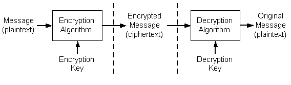

# Cryptography Concepts

Secure communication over nonsecure networks generally involves three major areas of concern: [privacy](#privacy), [authentication](#authentication), and [integrity](#integrity). The Microsoft cryptography API ([*CryptoAPI*](../secgloss/c-gly.md)) is a set of functions, interfaces, and tools that applications can use to improve confidence of security in these areas.

In addition to functionality for privacy, authentication, and integrity, [*CryptoAPI*](../secgloss/c-gly.md) also provides for:

-   Encoding messages to [*Abstract Syntax Notation One*](../secgloss/a-gly.md) (ASN.1) form.
-   Decoding ASN.1 messages.
-   Managing collections of [*certificates*](../secgloss/c-gly.md) in [*certificate stores*](../secgloss/c-gly.md).
-   Working with [*certificate trust lists*](../secgloss/c-gly.md) and certificate chains for verification of the validity of certificates.

## Privacy

To achieve privacy, users must prevent anyone except the intended recipient from reading a message. Improving the likelihood of privacy usually involves using some form of [*cryptography*](../secgloss/c-gly.md). Cryptographic techniques are used to encrypt (scramble) messages before the messages are stored or transmitted.

Data encryption transforms [*plaintext*](../secgloss/p-gly.md) into [*ciphertext*](../secgloss/c-gly.md). The data to be encrypted can be [*ASCII*](../secgloss/a-gly.md) text, a database file, or any other data. In this documentation, the term [*message*](../secgloss/m-gly.md) is used to refer to any piece of data, plaintext refers to data that has not been encrypted, and *ciphertext* refers to data that has been encrypted. A good data encryption system makes it difficult to transform encrypted data back to plaintext without a secret key.

Encrypted data can be stored on non-secure media or transmitted over a non-secure network. Later, the data can be decrypted into its original form. This process is shown in the following illustration.

When data is encrypted, the message and an [*encryption*](../secgloss/e-gly.md) key are passed to the encryption algorithm. To decrypt the data, the ciphertext and a [*decryption*](../secgloss/d-gly.md) key are passed to the decryption algorithm. Encryption and decryption can be done by using a single key in a process called symmetric encryption.

Keys used to decrypt a message must be kept as secret and safe as possible, and must be transmitted to other users by using security-enhancing techniques. This is discussed further in [Data Encryption and Decryption](data-encryption-and-decryption.md). The main challenge is properly restricting access to the decryption key because anyone who possesses it will be able to decrypt all messages that were encrypted with its corresponding encryption key.

To address the stated goals of privacy, developers can use [*CryptoAPI*](../secgloss/c-gly.md) to encrypt and digitally sign data in a flexible manner, while helping to provide protection for the user's sensitive private key data.

[*CryptoAPI*](../secgloss/c-gly.md) provides the following areas of functionality to perform the tasks of encryption/decryption, message signing, and key storage:

-   [Base Cryptography Functions](cryptography-functions.md)
-   [Simplified Message Functions](cryptography-functions.md)
-   [Low-Level Message Functions](cryptography-functions.md)

## Authentication

Secure communications require that the individuals communicating know the identity of those with whom they communicate. Authentication is the process of verifying the identity of a person or entity.

For example, in day to day life, physical documentation, often called credentials, are used to verify a person's identity. When a check is cashed, the person cashing the check can ask to see a driver's license. The driver's license is a physical document that increases the merchant's confidence in the identity of the person cashing the check. In this case, the person cashing the check trusts that the state issuing the license adequately verified the license holder's identity.

Passports provide another example. A customs official looks at a passport and accepts it as proof that a person is who he says he is. The official trusts that the government did an adequate job of identifying the passport holder before issuing the passport. In both examples, a level of trust exists in the issuer of the physical document.

Authentication also involves making sure that the data received is the data that was sent. If party A sends a message to party B, party B needs to be able to prove that the message received was the message that party A sent and not a message that was substituted for that message. To provide this form of authentication, [*CryptoAPI*](../secgloss/c-gly.md) provides functions for signing data and verifying signatures by using public/private key pairs.

Because communications over a computer network take place with no physical contact between the communicators, verifying identity often depends upon a credential that can be sent and received over a network. Such a credential must be issued by a trusted issuer of credentials. Digital certificates, commonly known as certificates, are just such a credential. They are a way to verify identity and achieve authentication on a computer network.

A digital certificate is a credential issued by a trusted organization or entity called a certification authority (CA). This credential contains a public key (see [Public/Private Key Pairs](public-private-key-pairs.md)) and data that identifies the certificate's subject. A certificate is issued by a CA only after the CA has verified the certificate subject's identity and has confirmed that the public key included with the certificate belongs to that subject.

The communication between a CA and a certificate requester could be accomplished by the requester physically carrying the necessary information, perhaps stored on a floppy disk, to the CA. However, the communication is usually accomplished with a signed message sent over a network. The CA often uses a trusted application called a certificate server to issues certificates.

[*CryptoAPI*](../secgloss/c-gly.md) supports authentication through the use of digital certificates, with certificate encode/decode functions, and [*certificate store*](../secgloss/c-gly.md) functions.

For more information about identity verification and authentication through the use of certificates, see [Digital Certificates](digital-certificates.md).

## Integrity

Any data sent over a non-secure media can be changed either by accident or on purpose. In the real world, seals are used to provide and prove integrity. A bottle of aspirin, for example, can come in tamper-proof packaging that has an unbroken seal to prove that nothing was put into the package after the package left the manufacturer.

In the same manner, a receiver of data must be able to verify the identity of the sender of the data and be sure that the data received is exactly the data that was sent; that is, that it has not been tampered with. Establishing the [*integrity*](../secgloss/i-gly.md) of data received is often done by sending not only the original data but also a verification message, called a [*hash*](../secgloss/h-gly.md), about that data. Both the data and the verification message can be sent with a [*digital signature*](../secgloss/d-gly.md) that proves the origin of both.

Integrity is provided in CryptoAPI by means of using [Digital Signatures](digital-signatures.md) and [Data Hashes](data-hashes.md).

[*CryptoAPI*](../secgloss/c-gly.md) supports integrity through the use of message functions to sign data and to verify digital signatures.

 

 
