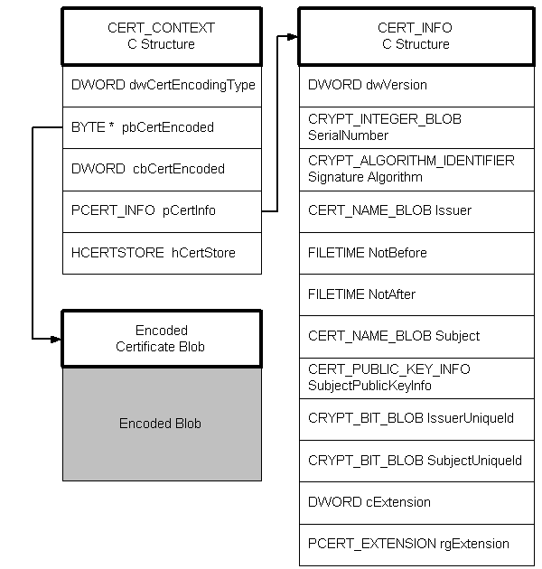
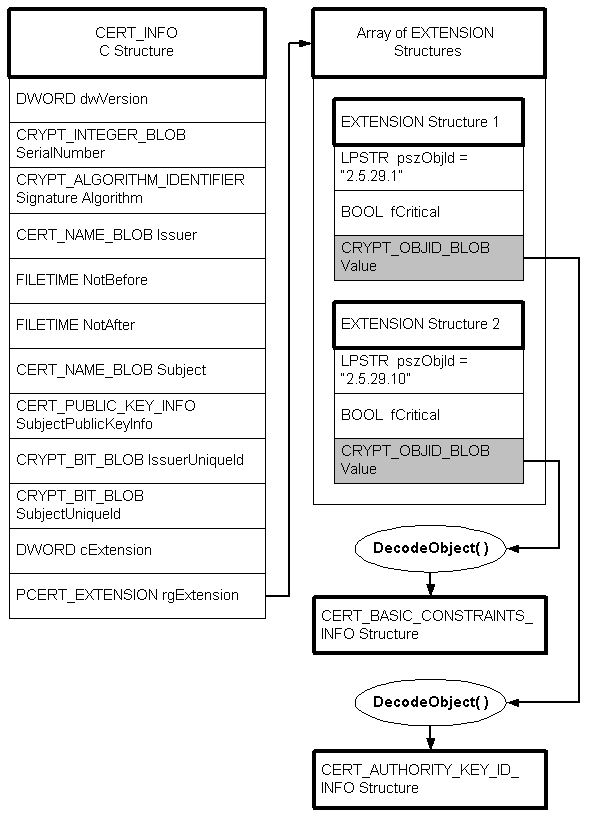

# Decoding a CERT\_INFO Structure

Given a certificate, the first step in decoding the certificate [*BLOB*](security.b_gly#-security-blob-gly) is to call [**CertCreateCertificateContext**](/windows/win32/Wincrypt/nf-wincrypt-certcreatecertificatecontext?branch=master), passing it a pointer to the encoded certificate (*BLOB*). When this function is called, it creates a duplicate of the encoded certificate, creates a structure of type [**CERT\_CONTEXT**](/windows/win32/Wincrypt/ns-wincrypt-_cert_context?branch=master), and creates a structure of type [**CERT\_INFO**](/windows/win32/Wincrypt/ns-wincrypt-_cert_info?branch=master). As shown in the following illustration, a [*certificate context*](security.c_gly#-security-certificate-context-gly) includes the original certificate *BLOB*, a C structure of type **CERT\_CONTEXT**, and a C structure of type **CERT\_INFO**. One of the members of the **CERT\_CONTEXT** structure points to the **CERT\_INFO** structure and another to the encoded certificate BLOB.

The encoded object (data member) is always provided as the input to the [**CryptDecodeObject**](/windows/win32/Wincrypt/nf-wincrypt-cryptdecodeobject?branch=master) function, and the output is a C structure that may or may not have encoded members, depending on how far into the process you are.

There is one other member that requires some decoding, and that is the **Extension** member. Although it is not encoded at the [**CERT\_INFO**](/windows/win32/Wincrypt/ns-wincrypt-_cert_info?branch=master) level, it does contain some encoded information. To decode this information, proceed as shown in the following illustration.

In the [**CERT\_INFO**](/windows/win32/Wincrypt/ns-wincrypt-_cert_info?branch=master) structure, member **rgExtension** is a pointer to an array of [**CERT\_EXTENSION**](/windows/win32/Wincrypt/ns-wincrypt-_cert_extension?branch=master) structures. Each **CERT\_EXTENSION** structure has a **Value** member that is in encoded form and needs to be decoded. The **Value** member is passed to the [**CryptDecodeObject**](/windows/win32/Wincrypt/nf-wincrypt-cryptdecodeobject?branch=master) function, and then the output from the function depends on the value of the **pszObjId** member. Notice that in the illustration, two different structures are produced, one of type [**CERT\_BASIC\_CONSTRAINTS\_INFO**](/windows/win32/Wincrypt/ns-wincrypt-_cert_basic_constraints_info?branch=master) and one of type [**CERT\_AUTHORITY\_KEY\_ID\_INFO**](/windows/win32/Wincrypt/ns-wincrypt-_cert_authority_key_id_info?branch=master), depending on the value of **pszObjId**.

 

 

