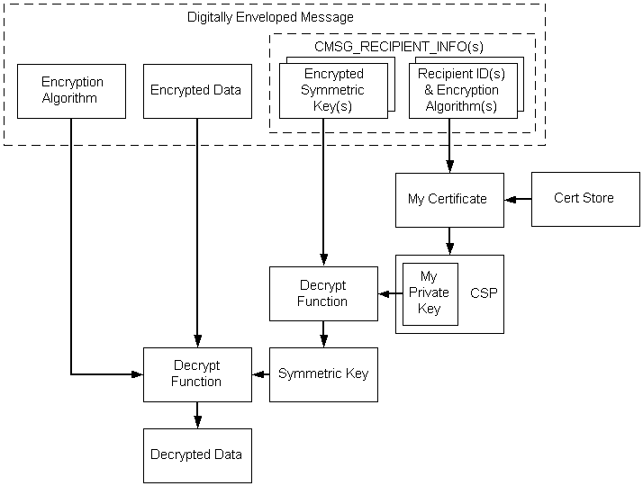

# Decoding Enveloped Data

The general tasks required to decode an enveloped message are depicted in the following illustration and described in the list that follows it.

The sequence of events for decoding enveloped data using key transport key management, as depicted in the previous illustration, is as follows:

-   A pointer to the [*digitally enveloped*](security.d_gly#-security-digital-envelope-gly) message is retrieved.
-   A [*certificate store*](security.c_gly#-security-certificate-store-gly) is opened.
-   From the message, the recipient ID (My ID) is retrieved.
-   The recipient ID is used to retrieve the certificate.
-   The [*private key*](security.p_gly#-security-private-key-gly) associated with that certificate is retrieved.
-   The private key is used to decrypt the [*symmetric*](security.s_gly#-security-symmetric-key-gly) ([*session*](security.s_gly#-security-session-key-gly)) key.
-   The encryption algorithm is retrieved from the message.
-   Using the private key and encryption algorithm, the data is decrypted.

The following procedure uses low-level message functions to accomplish the tasks just listed.

**To decode an enveloped message**

1.  Get a pointer to the encoded BLOB.
2.  Call [**CryptMsgOpenToDecode**](/windows/win32/Wincrypt/nf-wincrypt-cryptmsgopentodecode?branch=master), passing the necessary arguments.
3.  Call [**CryptMsgUpdate**](/windows/win32/Wincrypt/nf-wincrypt-cryptmsgupdate?branch=master) once, passing in the handle retrieved in step 2 and a pointer to the data that is to be decoded. This causes the appropriate actions to be taken on the message, depending on the message type.
4.  Call [**CryptMsgGetParam**](/windows/win32/Wincrypt/nf-wincrypt-cryptmsggetparam?branch=master), passing in the handle retrieved in step 2 and CMSG\_TYPE\_PARAM to verify that the message is of the enveloped data type.
5.  Again call [**CryptMsgGetParam**](/windows/win32/Wincrypt/nf-wincrypt-cryptmsggetparam?branch=master), passing in CMSG\_INNER\_CONTENT\_TYPE\_PARAM to get the data type of the [*inner content*](security.i_gly#-security-inner-content-gly).
6.  If the inner content data type is **data**, proceed to decrypt and decode the content. Otherwise, run a decoding procedure appropriate for the content data type.
7.  Assuming the inner content type is "data", initialize the [**CMSG\_CTRL\_DECRYPT\_PARA**](/windows/win32/Wincrypt/ns-wincrypt-_cmsg_ctrl_decrypt_para?branch=master) data structure, and call [**CryptMsgControl**](/windows/win32/Wincrypt/nf-wincrypt-cryptmsgcontrol?branch=master), passing in CMSG\_CTRL\_DECRYPT and the address of the structure. The content will be decrypted.
8.  Call [**CryptMsgGetParam**](/windows/win32/Wincrypt/nf-wincrypt-cryptmsggetparam?branch=master), passing in CMSG\_CONTENT\_PARAM to get a pointer to the decoded content data BLOB (**BYTE** string).
9.  Call [**CryptMsgClose**](/windows/win32/Wincrypt/nf-wincrypt-cryptmsgclose?branch=master) to close the message.

The result of this procedure is that the message is decoded and decrypted and a pointer is retrieved to the content data BLOB.

## Related topics

<dl> <dt>

[Example C Program: Encoding an Enveloped, Signed Message](example-c-program-encoding-an-enveloped-signed-message.md)
</dt> </dl>

 

 

