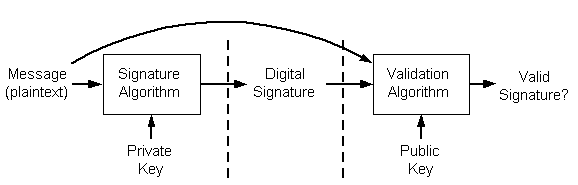
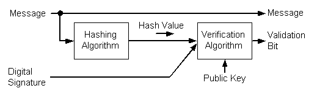

# Digital Signatures

[*Digital signatures*](../secgloss/d-gly.md) can be used to distribute a message in [*plaintext*](../secgloss/p-gly.md) form when the recipients must identify and verify the message sender. Signing a message does not alter the message; it simply generates a digital signature string you can either bundle with the message or transmit separately. A digital signature is a short piece of data that is encrypted with the sender's [*private key*](../secgloss/p-gly.md). Decrypting the signature data using the sender's [*public key*](../secgloss/p-gly.md) proves that the data was encrypted by the sender or by someone who had access to the sender's private key.

Digital signatures are generated by using [*public key*](../secgloss/p-gly.md) signature algorithms. A [*private key*](../secgloss/p-gly.md) generates the signature, and the corresponding public key must be used to validate the signature. This process is shown in the following illustration.

There are two steps involved in creating a digital signature from a message. The first step involves creating a [*hash*](../secgloss/h-gly.md) value (also known as a [*message digest*](../secgloss/m-gly.md)) from the message. This hash value is then signed, using the signer's private key. The following is an illustration of the steps involved in creating a digital signature.

To verify a signature, both the message and the signature are required. First, a hash value must be created from the message in the same way the signature was created. This hash value is then verified against the signature by using the public key of the signer. If the hash value and the signature match, you can be confident that the message is indeed the one the signer originally signed and that it has not been tampered with. The following diagram illustrates the process involved in verifying a digital signature.

A hash value consists of a small amount of binary data, typically around 160 bits. This is produced by using a [*hashing algorithm*](../secgloss/h-gly.md). A number of these algorithms are listed later in this section.

All hash values share the following properties, regardless of the algorithm used:

-   The length of the hash value is determined by the type of algorithm used, and its length does not vary with the size of the message. The most common hash value lengths are either 128 or 160 bits.
-   Every pair of non-identical messages translates into a completely different hash value, even if the two messages differ only by a single bit. Using today's technology, it is not feasible to discover a pair of messages that translate to the same hash value without breaking the hashing algorithm.
-   Each time a particular message is hashed using the same algorithm, the same hash value is produced.
-   All hashing algorithms are one-way. Given a hash value, it is not possible to recover the original message. In fact, none of the properties of the original message can be determined given the hash value alone.

 

 
