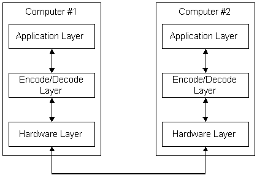

# Encoded and Decoded Data

To send data over a communication medium such as a phone line, the data must be [*serialized*](../secgloss/s-gly.md)— that is, converted into a string of ones and zeros that are transmitted serially over the line. Serialization must be done in such a way that the computer receiving the data can convert the data back into its original format. How serialization is accomplished is called a [*communication protocol*](../secgloss/c-gly.md), and is controlled by both software and data-transmission hardware. There are several levels at which the data is converted. The following illustration shows a greatly simplified view of communication protocol layers.

The preceding illustration shows the application layer on Computer \#1 sending the data to be transmitted (which usually consists of some combination of textual characters and numbers) to the encode/decode layer. The encode/decode layer encodes the data into a stream of computer bytes. At the lowest level, the hardware layer, the hardware converts the bytes of data into a serial stream of ones and zeros that is transmitted over the line to Computer \#2. The hardware layer of Computer \#2 converts the ones and zeros back into computer bytes, and passes them up to the encode/decode layer for decoding. The encode/decode layer decodes the bytes back into their original format and passes the data up to the application layer.

An accepted software design principle is to use *abstraction*, that is, the process of describing a problem or object in terms of its general parameters rather than describing all the details necessary to solve the problem, or describing all the details of an object. Using abstraction, a designer can specify a software object that has specific qualities without concern for how the object is actually implemented in the software code. Such a practice leaves the implementation open. It also simplifies the specification and makes it possible to state axioms about the object that can be proved when the object is implemented. These axioms can then be assumed when the object is employed in another, higher-level object. Abstraction is the hallmark of most contemporary software specifications.

Most [*communication protocols*](../secgloss/c-gly.md) involve a good deal of abstraction. Objects at higher layers are defined abstractly and are intended to be implemented using objects at lower layers. For instance, a service at one layer might require transferring certain abstract objects between computers. A lower level layer can use encoding rules to transform the abstract objects into strings of ones and zeros.

One common method of specifying abstract objects intended to be serially transmitted is called [*Abstract Syntax Notation One*](../secgloss/a-gly.md) (ASN.1). ASN.1 is defined in CCITT Recommendation [*X.208*](../secgloss/x-gly.md). One set of ASN.1 rules for representing such objects as strings of ones and zeros is called the [*Distinguished Encoding Rules*](../secgloss/d-gly.md) (DER), and is defined in CCITT Recommendation [*X.509*](../secgloss/x-gly.md), Section 8.7. These are the encoding methods currently used by CryptoAPI.

For more information about encode/decode functions, see [Object Encoding and Decoding Functions](cryptography-functions.md).

 

 
