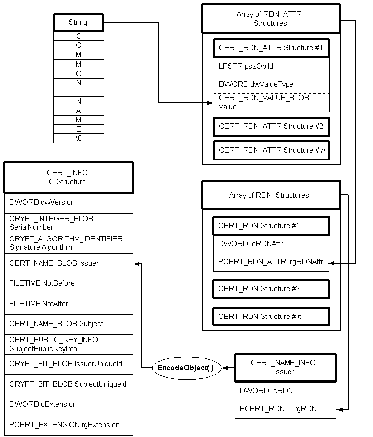
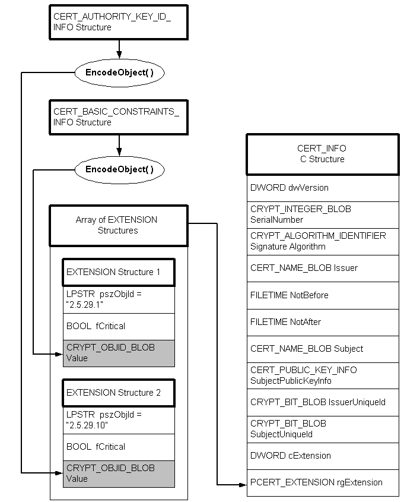

# Encoding a CERT\_INFO Structure

The encoding process is the reverse of the decoding process described in [Decoding a CERT\_INFO Structure](decoding-a-cert-info-structure.md). For example, the following procedure would add an encoded **Issuer** to a [**CERT\_INFO**](/windows/desktop/api/Wincrypt/ns-wincrypt-cert_info) structure. Also see the illustration that follows the procedure.

**To add an encoded Issuer to a CERT\_INFO structure**

1.  Create a string containing the issuer name to be used.
2.  Create an array of [**CERT\_RDN\_ATTR**](/windows/desktop/api/Wincrypt/ns-wincrypt-cert_rdn_attr) structures, which will be initialized to contain the proper information about the issuer name string just created.
3.  Create an array of [**CERT\_RDN**](/windows/desktop/api/Wincrypt/ns-wincrypt-cert_rdn) structures, one of which has the information about the array of [**CERT\_RDN\_ATTR**](/windows/desktop/api/Wincrypt/ns-wincrypt-cert_rdn_attr) structures just initialized.
4.  Create a [**CERT\_NAME\_INFO**](/windows/desktop/api/Wincrypt/ns-wincrypt-cert_name_info) structure that has a pointer to the array of [**CERT\_RDN**](/windows/desktop/api/Wincrypt/ns-wincrypt-cert_rdn) structures that just created.
5.  Call [**CryptEncodeObject**](/windows/desktop/api/Wincrypt/nf-wincrypt-cryptencodeobject) to get the size of the output encoded BLOB, passing it the address of the [**CERT\_NAME\_INFO**](/windows/desktop/api/Wincrypt/ns-wincrypt-cert_name_info) structure that you just created.
6.  Allocate memory for the output encoded BLOB.
7.  Call [**CryptEncodeObject**](/windows/desktop/api/Wincrypt/nf-wincrypt-cryptencodeobject) again, passing it the same information, but now passing it the address of the memory just allocated.
8.  Set the **Issuer.cbData** member of the [**CERT\_INFO**](/windows/desktop/api/Wincrypt/ns-wincrypt-cert_info) structure to the size returned in step 5, and the **Issuer.pbData** member to the address obtained in step 6. The encoded **Issuer** BLOB now resides there.

To initialize and encode some certificate extension information, use the following procedure. Also see the illustration that follows the procedure.

**To add encoded extension information to a CERT\_INFO structure**

1.  Create and initialize an extension information structure—for this example, it is a [**CERT\_BASIC\_CONSTRAINTS\_INFO**](/windows/desktop/api/Wincrypt/ns-wincrypt-cert_basic_constraints_info) structure.
2.  Call [**CryptEncodeObject**](/windows/desktop/api/Wincrypt/nf-wincrypt-cryptencodeobject), passing it the address of the structure just created, to get the size of the output encoded BLOB.
3.  Allocate memory for the output encoded BLOB.
4.  Call [**CryptEncodeObject**](/windows/desktop/api/Wincrypt/nf-wincrypt-cryptencodeobject) again, passing the same information, except now pass in the address of the allocated memory.
5.  Create an array of [**CERT\_EXTENSION**](/windows/desktop/api/Wincrypt/ns-wincrypt-cert_extension) structures.
6.  Initialize one of the [**CERT\_EXTENSION**](/windows/desktop/api/Wincrypt/ns-wincrypt-cert_extension) structures so that the **pszObjId** is the proper string for the data contained in **Value**, and that **Value** contains the encrypted data BLOB that was output from the call to [**CryptEncodeObject**](/windows/desktop/api/Wincrypt/nf-wincrypt-cryptencodeobject).
7.  Initialize the **rgExtension** member of the [**CERT\_INFO**](/windows/desktop/api/Wincrypt/ns-wincrypt-cert_info) structure to point to the array of [**CERT\_EXTENSION**](/windows/desktop/api/Wincrypt/ns-wincrypt-cert_extension) structures.

 

 

