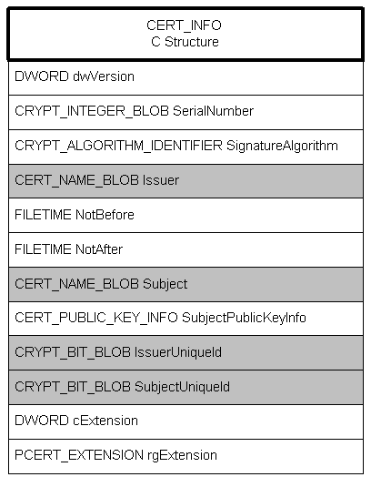
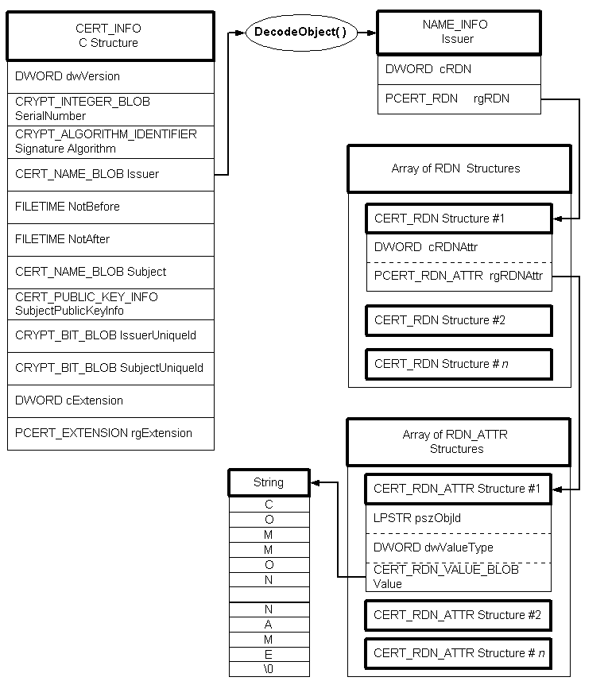

# Encoding and Decoding a Certificate Context

[*CryptoAPI*](https://www.bing.com/search?q=*CryptoAPI*) supports the encoding and decoding of [*certificates*](https://www.bing.com/search?q=*certificates*). CryptoAPI includes an extensive, flexible system of functions and C structures that allow encoding and decoding in various ways. CryptoAPI supports standard [*X.509*](https://www.bing.com/search?q=*X.509*) certificate structure and standard [*Abstract Syntax Notation One*](https://www.bing.com/search?q=*Abstract Syntax Notation One*) (ASN.1) encoding to provide interoperability with other systems.

For an overview of encoded data, see [Encoded and Decoded Data](encoded-and-decoded-data.md).

## Certificate Contexts

A [*certificate context*](https://www.bing.com/search?q=*certificate context*), [**CERT\_CONTEXT**](/windows/desktop/api/Wincrypt/ns-wincrypt-_cert_context), is a C structure that contains an encoded member, a handle to a [*certificate store*](https://www.bing.com/search?q=*certificate store*), a pointer to the original encoded [*certificate BLOB*](https://www.bing.com/search?q=*certificate BLOB*), and a pointer to a [**CERT\_INFO**](/windows/desktop/api/Wincrypt/ns-wincrypt-_cert_info) C structure.

The [**CERT\_INFO**](/windows/desktop/api/Wincrypt/ns-wincrypt-_cert_info) structure is the heart of the certificate. It contains, in direct form and in encoded form, all the basic information in the certificate. The following illustration shows the **CERT\_INFO** structure with all of its encoded members shown as shaded.

The **IssuerUniqueID** and **SubjectUniqueID** members are part of the [*X.509*](https://www.bing.com/search?q=*X.509*) version 2 certificate implementation but are seldom used. Certificate extensions in version 3 replace the functionality of these members.

If the information contained in the encoded (shaded) members **Issuer** and **Subject** is needed, those members must be decoded. Use [**CryptDecodeObject**](/windows/desktop/api/Wincrypt/nf-wincrypt-cryptdecodeobject) to decode these members. The following illustration shows the process of decoding one of these members.

In the illustrated case, the [**CryptDecodeObject**](/windows/desktop/api/Wincrypt/nf-wincrypt-cryptdecodeobject) function creates a [**CERT\_NAME\_INFO**](/windows/desktop/api/Wincrypt/ns-wincrypt-_cert_name_info) structure, an array of [**CERT\_RDN**](/windows/desktop/api/Wincrypt/ns-wincrypt-_cert_rdn) structures, a corresponding array of [**CERT\_RDN\_ATTR**](/windows/desktop/api/Wincrypt/ns-wincrypt-_cert_rdn_attr) structures, and a string that contains the name. Members of the **CERT\_RDN\_ATTR** structure determine the contents of the string. For example, if the **pszObjId** member is 2.5.4.3, the string contains a common name. If it is 2.5.4.10, the string would contain an organization name. For a list of these [*object identifiers*](https://www.bing.com/search?q=*object identifiers*) (OIDs), see **CERT\_RDN\_ATTR**.

The **dwValueType** member contains information about the type of string. If it is CERT\_RDN\_PRINTABLE\_STRING, the value member contains a byte-width, zero-terminated character string. If it is CERT\_RDN\_UNICODE\_STRING, the string is a double-width (word-sized) character string.

For a detailed process for encoding and decoding certificates, see [Encoding a CERT\_INFO Structure](encoding-a-cert-info-structure.md) and [Decoding a CERT\_INFO Structure](decoding-a-cert-info-structure.md).

 

 

