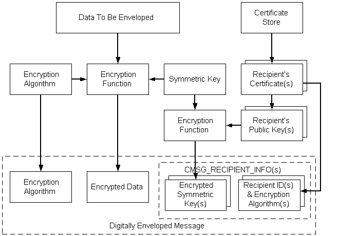

# Encoding Enveloped Data

Enveloped data consists of encrypted content of any type and encrypted content-encryption session keys for one or more recipients. Enveloped messages keep the contents of the message secret and allow only specified persons or entities to retrieve the contents.

Cryptographic message syntax (CMS) can be used to encode enveloped messages. CMS supports three key management techniques: key transport, key agreement, and previously distributed symmetric key-encryption keys (KEK). Previously distributed symmetric KEK are also known as mailing list key distribution.

In each of these three techniques, a single session key is generated to encrypt the enveloped message. Key management issues deal with the way that session key is encrypted by the sender and decrypted by a receiver. A single encrypted message can be distributed to many recipients using a mixture of the key management techniques.

Key transport key management uses an intended receiver's public key to encrypt the session key. The receiver decrypts the session key using the private key associated with the public key that was used to encrypt. The receiver then uses the decrypted session key to decrypt the enveloped data. When key transport is used, the receiver has not confirmed information on the identity of the sender.

In key agreement management, a temporary, ephemeral Diffie-Hellman private key is generated and used to encrypt the session key. The public key corresponding to the ephemeral private key is included as part of the message's recipient information. The recipient decrypts the session key using the received ephemeral key and uses this decrypted session key to decrypt the enveloped message. Using ephemeral key agreement in conjunction with the receiver's private key, the message receiver does have confirmed information on the identity of the sender.

For key management using previously distributed [*symmetric keys*](../secgloss/s-gly.md), each message includes the content-encryption key that has been encrypted with a previously distributed key-encryption key. Receivers use the previously distributed key-encryption key to decrypt the content encryption key, then use the decrypted content-encryption key to decrypt the enveloped message.

A typical CMS sequence of events for encoding enveloped data, is shown in the following illustration.

-   A pointer to the [*plaintext*](../secgloss/p-gly.md) message is retrieved.
-   A symmetric ([*session*](../secgloss/s-gly.md)) key is generated.
-   The [*symmetric key*](../secgloss/s-gly.md) and specified encryption algorithm are used to encrypt the message data.
-   A [*certificate store*](../secgloss/c-gly.md) is opened.
-   The recipient's certificate is retrieved from the store.
-   The [*public key*](../secgloss/p-gly.md) is retrieved from the recipient's certificate.
-   Using the recipient's public key, the symmetric key is encrypted.
-   From the recipient's certificate, the recipient's ID is retrieved.
-   The following information is included in the digitally enveloped message: the data encryption algorithm, the encrypted data, the encrypted symmetric key, and the recipient information structure.

To use low-level message functions to accomplish the typical tasks just listed, use the following procedure.

**To encode an enveloped message**

1.  Create or retrieve the content.
2.  Get a cryptographic provider.
3.  Get a recipient certificate.
4.  Initialize the [**CMSG\_ENVELOPED\_ENCODE\_INFO**](/windows/desktop/api/Wincrypt/ns-wincrypt-cmsg_enveloped_encode_info) structure.
5.  Call [**CryptMsgCalculateEncodedLength**](/windows/desktop/api/Wincrypt/nf-wincrypt-cryptmsgcalculateencodedlength) to get the size of the encoded message BLOB. Allocate memory for it.
6.  Call [**CryptMsgOpenToEncode**](/windows/desktop/api/Wincrypt/nf-wincrypt-cryptmsgopentoencode), passing in CMSG\_ENVELOPED for *dwMsgType* and a pointer to [**CMSG\_ENVELOPED\_ENCODE\_INFO**](/windows/desktop/api/Wincrypt/ns-wincrypt-cmsg_enveloped_encode_info) for *pvMsgEncodeInfo*. As a result of this call, you will get a handle to the opened message.
7.  Call [**CryptMsgUpdate**](/windows/desktop/api/Wincrypt/nf-wincrypt-cryptmsgupdate), passing in the handle retrieved in step 6 and a pointer to the data that is to be encrypted, enveloped, and encoded. This function can be called as many times as necessary to complete the encoding process.
8.  Call [**CryptMsgGetParam**](/windows/desktop/api/Wincrypt/nf-wincrypt-cryptmsggetparam), passing in the handle retrieved in step 6 and the appropriate parameter types to access the desired, encoded data. For example, pass in CMSG\_CONTENT\_PARAM to get a pointer to the entire PKCS \#7 message.

    If the result of this encoding is to be used as the [*inner data*](../secgloss/i-gly.md) for another encoded message, such as an enveloped message, the CMSG\_BARE\_CONTENT\_PARAM parameter must be passed. For an example, see [Alternate Code for Encoding an Enveloped Message](alternate-code-for-encoding-an-enveloped-message.md).

9.  Close the message by calling [**CryptMsgClose**](/windows/desktop/api/Wincrypt/nf-wincrypt-cryptmsgclose).

The result of this procedure is an encoded message that contains the encrypted data, the [*symmetric key*](../secgloss/s-gly.md) that is encrypted with the recipient's public keys, and the recipient information data structures. The combination of encrypted content and an encrypted symmetric key for a recipient is a [*digital envelope*](../secgloss/d-gly.md) for that recipient. Any type of content can be enveloped for multiple recipients.

## Related topics

<dl> <dt>

[Example C Program: Encoding an Enveloped, Signed Message](example-c-program-encoding-an-enveloped-signed-message.md)
</dt> </dl>

 

 
