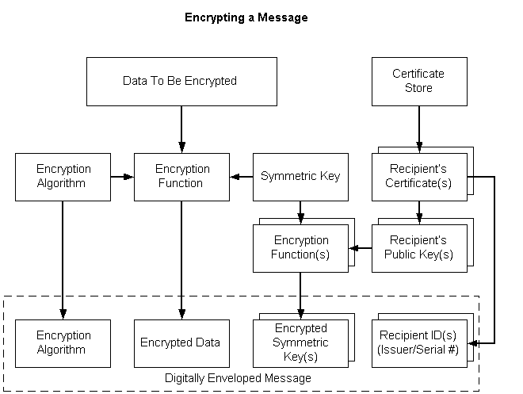

# Encrypting Data

The following procedure describes steps to take to encrypt a message with the Base Cryptography Functions. To encrypt messages using PKCS \#7 standards, see [Low-level Message Functions](cryptography-functions.md) and [Simplified Message Functions](cryptography-functions.md).

**To encrypt a message**

1.  Generate a session key by using the [**CryptGenKey**](/windows/desktop/api/Wincrypt/nf-wincrypt-cryptgenkey) function.

    Making this call generates a random key and returns a handle so the key can be used to encrypt and decrypt data. The encryption algorithm to use is also specified at this point. Because CryptoAPI does not permit applications to use public key algorithms to encrypt bulk data, specify a symmetric algorithm such as RC2 or RC4 with the [**CryptGenKey**](/windows/desktop/api/Wincrypt/nf-wincrypt-cryptgenkey) call.

2.  Alternatively, use the [**CryptDeriveKey**](/windows/desktop/api/Wincrypt/nf-wincrypt-cryptderivekey) function to transform a password into a key suitable for encryption.

    If an application needs to encrypt the message so that anyone with a specified password can decrypt the data, use [**CryptDeriveKey**](/windows/desktop/api/Wincrypt/nf-wincrypt-cryptderivekey) to transform the password into a key suitable for encryption.

    > [!Note]  
    > In this case, this function is called instead of the [**CryptGenKey**](/windows/desktop/api/Wincrypt/nf-wincrypt-cryptgenkey) function and the subsequent [**CryptExportKey**](/windows/desktop/api/Wincrypt/nf-wincrypt-cryptexportkey) calls are not needed.

     

3.  If necessary, set extra cryptographic properties of the key by using the [**CryptSetKeyParam**](/windows/desktop/api/Wincrypt/nf-wincrypt-cryptsetkeyparam) function

    After the key has been generated, extra cryptographic properties of the key can be set with the [**CryptSetKeyParam**](/windows/desktop/api/Wincrypt/nf-wincrypt-cryptsetkeyparam)function. This function allows different sections of the file to be encrypted with different key salts and provides a way to change the cipher mode or initialization vector of the key. These parameters can be used to make the encryption conform with a particular data encryption standard.

4.  Encrypt the data in the file with the [**CryptEncrypt**](/windows/desktop/api/Wincrypt/nf-wincrypt-cryptencrypt) function.

    The [**CryptEncrypt**](/windows/desktop/api/Wincrypt/nf-wincrypt-cryptencrypt) function takes the session key that was generated in the previous step and encrypts a buffer of data.

    > [!Note]  
    > As the data is encrypted, the data may be slightly expanded by the encryption algorithm. The application is responsible for remembering the length of the encrypted data so the proper length can later be specified for the [**CryptDecrypt**](/windows/desktop/api/Wincrypt/nf-wincrypt-cryptdecrypt) function.

     

5.  Optionally, use the [**CryptExportKey**](/windows/desktop/api/Wincrypt/nf-wincrypt-cryptexportkey) function to allow the current user to decrypt the data in the future.

    To allow the current user to decrypt the data in the future, the [**CryptExportKey**](/windows/desktop/api/Wincrypt/nf-wincrypt-cryptexportkey) function is used to save the decryption key in an encrypted form (a key BLOB) that can only be decrypted with the user's private key. This function requires the user's key exchange public key for this purpose, which can be obtained by using the [**CryptGetUserKey**](/windows/desktop/api/Wincrypt/nf-wincrypt-cryptgetuserkey) function. The **CryptExportKey** function will return a key BLOB that must be stored by the application for use in decrypting the file

> [!Note]  
> If the application has certificates (or public keys) for other users, it can permit other users to decrypt the file by performing [**CryptExportKey**](/windows/desktop/api/Wincrypt/nf-wincrypt-cryptexportkey) calls for each user who should receive access. The returned key BLOBs must be stored by the application, as in step 5.

 

## Creating an Encrypted Message

The simplified message functions make it easier to encrypt and decrypt data. The following illustration depicts the individual tasks that must be accomplished to encrypt a message. The steps are described in the following list.

**To encrypt a message**

1.  Get a pointer to the plaintext message.
2.  Generate a symmetric (session) key.
3.  Using the symmetric key and specified encryption algorithm, encrypt the message data.
4.  Open a certificate store.
5.  Get the recipient's certificate.
6.  Get the public key from the recipient's certificate.
7.  Using the recipient's public key, encrypt the symmetric key.
8.  Get the recipient's identifier from the recipient's certificate.
9.  Include the following in the digitally enveloped message: the data encryption algorithm, the encrypted data, the encrypted symmetric key, and the recipient identifier.

 

 

