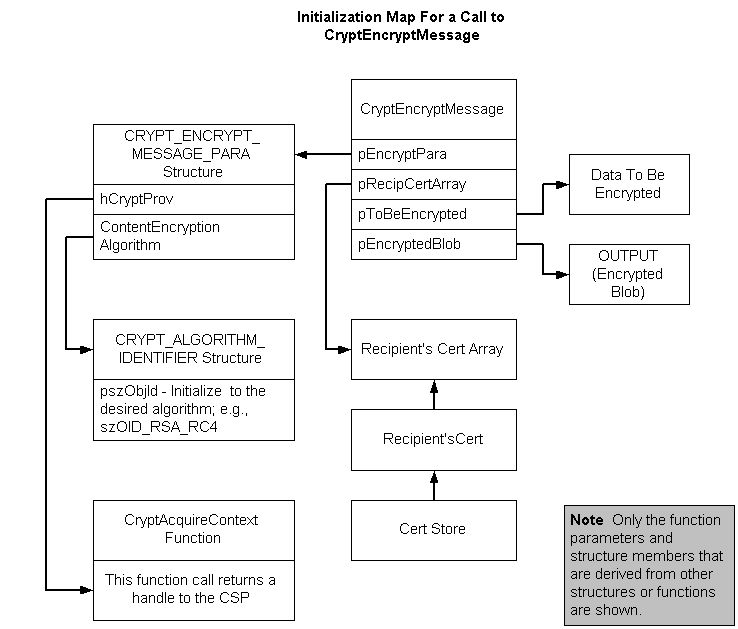

# Example C Program: Using CryptEncryptMessage and CryptDecryptMessage

[**CryptEncryptMessage**](/windows/desktop/api/Wincrypt/nf-wincrypt-cryptencryptmessage) is the only function call necessary to accomplish all of the tasks listed in [Encrypting a Message](../secauthn/encrypting-a-message.md). Initialization of data structures is necessary. The following illustration shows the relationship between those function parameters that point to structures or arrays and their initialized data. This example also decrypts the message using [**CryptDecryptMessage**](/windows/desktop/api/Wincrypt/nf-wincrypt-cryptdecryptmessage).



**To encrypt data**

1.  Get a pointer to the content to be encrypted.
2.  Determine the size of the content to be encrypted.
3.  Acquire a handle to a cryptographic provider.
4.  Open a [*certificate store*](../secgloss/c-gly.md).
5.  Get the recipient certificate.
6.  Create the recipient certificate array.
7.  Initialize the [**CRYPT\_ALGORITHM\_IDENTIFIER**](/windows/desktop/api/Wincrypt/ns-wincrypt-crypt_algorithm_identifier) structure.
8.  Initialize the [**CRYPT\_ENCRYPT\_MESSAGE\_PARA**](/windows/desktop/api/Wincrypt/ns-wincrypt-crypt_encrypt_message_para) structure.
9.  Call [**CryptEncryptMessage**](/windows/desktop/api/Wincrypt/nf-wincrypt-cryptencryptmessage) to encrypt the content and create a digitally enveloped message.

The following example implements this procedure.

Comments relate code fragments to each step in the procedure. For more information about the function, see [**CryptEncryptMessage**](/windows/desktop/api/Wincrypt/nf-wincrypt-cryptencryptmessage). For more information about the data structures, see [**CRYPT\_ALGORITHM\_IDENTIFIER**](/windows/desktop/api/Wincrypt/ns-wincrypt-crypt_algorithm_identifier) and [**CRYPT\_ENCRYPT\_MESSAGE\_PARA**](/windows/desktop/api/Wincrypt/ns-wincrypt-crypt_encrypt_message_para).

This example uses the functions [**MyHandleError**](myhandleerror.md) and [**ByteToStr**](bytetostr.md). The code for this function is included with the sample. Code for this and other auxiliary functions is also listed under [General Purpose Functions](general-purpose-functions.md).


```C++
//-------------------------------------------------------------------
// Copyright (C) Microsoft.  All rights reserved.
// Example of encrypting data and creating an enveloped 
// message using CryptEncryptMessage.
#pragma comment(lib, "crypt32.lib")

#include <stdio.h>
#include <windows.h>
#include <Wincrypt.h>
#define MY_ENCODING_TYPE  (PKCS_7_ASN_ENCODING | X509_ASN_ENCODING)
void MyHandleError(char *s);
//-------------------------------------------------------------------
// This program uses the function GetRecipientCert, declared here and
// defined after main.

PCCERT_CONTEXT GetRecipientCert(
     HCERTSTORE hCertStore);

//-------------------------------------------------------------------
// This program uses the function ByteToStr, declared here and
// defined after main. Code for ByteToStr can also be found as one
// of the general purpose functions.

void ByteToStr(
     DWORD cb, 
     void* pv, 
     LPSTR sz);

//-------------------------------------------------------------------
// This program uses the function DecryptMessage, declared here and
// defined after main.

BOOL DecryptMessage( 
       BYTE *pbEncryptedBlob, 
       DWORD cbEncryptedBlob,
       HCRYPTPROV hCryptProv,
       HCERTSTORE hStoreHandle);

void main()
{
//-------------------------------------------------------------------
// Declare and initialize variables. This includes getting a pointer 
// to the message to be encrypted. This code creates a message
// and gets a pointer to it. In reality, the message content 
// usually exists somewhere and a pointer to the message is 
// passed to the application. 

BYTE* pbContent = (BYTE*) "Security is our business.";
                                            // The message
DWORD cbContent = strlen((char *)pbContent)+1;
                                            // Size of message
HCRYPTPROV hCryptProv;                      // CSP handle
HCERTSTORE hStoreHandle;
PCCERT_CONTEXT pRecipientCert;
PCCERT_CONTEXT RecipientCertArray[1];
DWORD EncryptAlgSize;
CRYPT_ALGORITHM_IDENTIFIER EncryptAlgorithm;
CRYPT_ENCRYPT_MESSAGE_PARA EncryptParams;
DWORD EncryptParamsSize;
BYTE*    pbEncryptedBlob;
DWORD    cbEncryptedBlob;

//-------------------------------------------------------------------
//  Begin processing.

printf("About to begin with the message %s.\n",pbContent);
printf("The message length is %d bytes. \n", cbContent);

//-------------------------------------------------------------------
// Get a handle to a cryptographic provider.

if(CryptAcquireContext(
            &hCryptProv,        // Address for handle to be returned.
            NULL,               // Use the current user's logon name.
            NULL,               // Use the default provider.
            PROV_RSA_FULL,      // Need to both encrypt and sign.
            NULL))              // No flags needed.
{
    printf("A CSP has been acquired. \n");
}
else
{
    MyHandleError("Cryptographic context could not be acquired.");
}
//-------------------------------------------------------------------
// Open a system certificate store.

if(hStoreHandle = CertOpenSystemStore(
     hCryptProv, 
     "MY"))
{
    printf("The MY store is open. \n");
}
else
{
    MyHandleError( "Error getting store handle.");
}
//-------------------------------------------------------------------
// Get a pointer to the recipient's certificate.
// by calling GetRecipientCert. 

if(pRecipientCert = GetRecipientCert(
     hStoreHandle))
{
    printf("A recipient's certificate has been acquired. \n");
}
else
{
    printf("No certificate with a CERT_KEY_CONTEXT_PROP_ID \n");
    printf("property and an AT_KEYEXCHANGE private key "
        "available. \n");
    printf("While the message could be encrypted, in this case, \n");
    printf("it could not be decrypted in this program. \n");
    printf("For more information, see the documentation for \n");
    printf("CryptEncryptMessage and CryptDecryptMessage.\n\n");
    MyHandleError( "No Certificate with AT_KEYEXCHANGE "
        "key in store.");
}
//-------------------------------------------------------------------
// Create a RecipientCertArray.

RecipientCertArray[0] = pRecipientCert;

//-------------------------------------------------------------------
// Initialize the algorithm identifier structure.

EncryptAlgSize = sizeof(EncryptAlgorithm);

//-------------------------------------------------------------------
// Initialize the structure to zero.

memset(&EncryptAlgorithm, 0, EncryptAlgSize);

//-------------------------------------------------------------------
// Set the necessary member.

EncryptAlgorithm.pszObjId = szOID_RSA_RC4;  

//-------------------------------------------------------------------
// Initialize the CRYPT_ENCRYPT_MESSAGE_PARA structure. 

EncryptParamsSize = sizeof(EncryptParams);
memset(&EncryptParams, 0, EncryptParamsSize);
EncryptParams.cbSize =  EncryptParamsSize;
EncryptParams.dwMsgEncodingType = MY_ENCODING_TYPE;
EncryptParams.hCryptProv = hCryptProv;
EncryptParams.ContentEncryptionAlgorithm = EncryptAlgorithm;

//-------------------------------------------------------------------
// Call CryptEncryptMessage.

if(CryptEncryptMessage(
          &EncryptParams,
          1,
          RecipientCertArray,
          pbContent,
          cbContent,
          NULL,
          &cbEncryptedBlob))
{
    printf("The encrypted message is %d bytes. \n",cbEncryptedBlob);
}
else
{
    MyHandleError( "Getting EncryptedBlob size failed.");
}
//-------------------------------------------------------------------
// Allocate memory for the returned BLOB.

if(pbEncryptedBlob = (BYTE*)malloc(cbEncryptedBlob))
{
    printf("Memory has been allocated for the encrypted BLOB. \n");
}
else
{
    MyHandleError("Memory allocation error while encrypting.");
}
//-------------------------------------------------------------------
// Call CryptEncryptMessage again to encrypt the content.

if(CryptEncryptMessage(
          &EncryptParams,
          1,
          RecipientCertArray,
          pbContent,
          cbContent,
          pbEncryptedBlob,
          &cbEncryptedBlob))
{
    printf( "Encryption succeeded. \n");
}
else
{
    MyHandleError("Encryption failed.");
}

//-------------------------------------------------------------------
// Call the function DecryptMessage, whose code follows main,
// to decrypt the message.

if(DecryptMessage( 
     pbEncryptedBlob, 
     cbEncryptedBlob,
     hCryptProv,
     hStoreHandle))
{
   printf("Decryption succeeded. \n");
}
else
{
   printf("Decryption failed. \n");
}
//-------------------------------------------------------------------
// Clean up memory.

CertFreeCertificateContext(pRecipientCert);
if(CertCloseStore(
          hStoreHandle, 
          CERT_CLOSE_STORE_CHECK_FLAG))
{
    printf("The MY store was closed without incident. \n");
}
else
{
   printf("Store closed after encryption -- \n"
      "but not all certificates or CRLs were freed. \n");
}
if(hCryptProv)
{
    CryptReleaseContext(hCryptProv,0);
    printf("The CSP has been released. \n");
}
else
{
    printf("CSP was NULL. \n");
}
} // End of main

//-------------------------------------------------------------------
//  Define the function DecryptMessage.

BOOL DecryptMessage( 
     BYTE *pbEncryptedBlob, 
     DWORD cbEncryptedBlob,
     HCRYPTPROV hCryptProv,
     HCERTSTORE hStoreHandle)

//-------------------------------------------------------------------
// Example function for decrypting an encrypted message using
// CryptDecryptMessage. Its parameters are pbEncryptedBlob,
// an encrypted message; cbEncryptedBlob, the length of that
// message; hCryptProv, a CSP; and hStoreHandle, the handle
// of an open certificate store.

{
//-------------------------------------------------------------------
// Declare and initialize local variables.

DWORD cbDecryptedMessage;
char* EncryptedString = new char[(cbEncryptedBlob * 2) +1];
HCERTSTORE CertStoreArray[] = {hStoreHandle};
CRYPT_DECRYPT_MESSAGE_PARA  DecryptParams;
DWORD  DecryptParamsSize = sizeof(DecryptParams);
BYTE*  pbDecryptedMessage;
LPSTR  DecryptedString;
BOOL   fReturn = TRUE;

//-------------------------------------------------------------------
// Get a pointer to the encrypted message, pbEncryptedBlob,
// and its length, cbEncryptedBlob. In this example, these are
// passed as parameters along with a CSP and an open store handle.

//-------------------------------------------------------------------
// View the encrypted BLOB.
// Call a function, ByteToStr, to convert the byte BLOB to ASCII
// hexadecimal format. 

ByteToStr(
    cbEncryptedBlob, 
    pbEncryptedBlob, 
    EncryptedString);

//-------------------------------------------------------------------
// Print the converted string.

printf("The encrypted string is: \n%s\n",EncryptedString);

//-------------------------------------------------------------------
//   In this example, the handle to the MY store was passed in as a 
//   parameter. 

//-------------------------------------------------------------------
//   Create a "CertStoreArray."
//   In this example, this step was done in the declaration
//   and initialization of local variables because the store handle 
//   was passed into the function as a parameter.

//-------------------------------------------------------------------
//   Initialize the CRYPT_DECRYPT_MESSAGE_PARA structure.

memset(&DecryptParams, 0, DecryptParamsSize);
DecryptParams.cbSize = DecryptParamsSize;
DecryptParams.dwMsgAndCertEncodingType = MY_ENCODING_TYPE;
DecryptParams.cCertStore = 1;
DecryptParams.rghCertStore = CertStoreArray;

//-------------------------------------------------------------------
//  Decrypt the message data.
//  Call CryptDecryptMessage to get the returned data size.

if(CryptDecryptMessage(
          &DecryptParams,
          pbEncryptedBlob,
          cbEncryptedBlob,
          NULL,
          &cbDecryptedMessage,
          NULL))
{
    printf("The size for the decrypted message is: %d.\n",
        cbDecryptedMessage);
}
else
{
    MyHandleError( "Error getting decrypted message size");
}
//-------------------------------------------------------------------
// Allocate memory for the returned decrypted data.

if(pbDecryptedMessage = (BYTE*)malloc(
       cbDecryptedMessage))
{
    printf("Memory has been allocated for the decrypted message. "
        "\n");
}
else
{
    MyHandleError("Memory allocation error while decrypting");
}
//-------------------------------------------------------------------
// Call CryptDecryptMessage to decrypt the data.

if(CryptDecryptMessage(
          &DecryptParams,
          pbEncryptedBlob,
          cbEncryptedBlob,
          pbDecryptedMessage,
          &cbDecryptedMessage,
          NULL))
{
    DecryptedString = (LPSTR) pbDecryptedMessage;
    printf("Message Decrypted Successfully. \n");
    printf("The decrypted string is: %s\n",DecryptedString);
}
else
{
    printf("Error decrypting the message \n");
    printf("Error code %x \n",GetLastError());
    fReturn = FALSE;
}

//-------------------------------------------------------------------
// Clean up memory.

free(pbEncryptedBlob);
free(pbDecryptedMessage);
return fReturn;
}  // End of DecryptMessage

//-------------------------------------------------------------------
// Define the function ByteToStr.

void ByteToStr(
     DWORD cb, 
     void* pv, 
     LPSTR sz)
//-------------------------------------------------------------------
// Parameters passed are:
//    pv is the array of BYTEs to be converted.
//    cb is the number of BYTEs in the array.
//    sz is a pointer to the string to be returned.

{
//-------------------------------------------------------------------
//  Declare and initialize local variables.

BYTE* pb = (BYTE*) pv; // Local pointer to a BYTE in the BYTE array
DWORD i;               // Local loop counter
int b;                 // Local variable

//-------------------------------------------------------------------
//  Begin processing loop.

for (i = 0; i<cb; i++)
{
   b = (*pb & 0xF0) >> 4;
   *sz++ = (b <= 9) ? b + '0' : (b - 10) + 'A';
   b = *pb & 0x0F;
   *sz++ = (b <= 9) ? b + '0' : (b - 10) + 'A';
   pb++;
}
*sz++ = 0;
} // End of ByteToStr

//-------------------------------------------------------------------
//  This example uses the function MyHandleError, a simple error
//  handling function, to print an error message to the  
//  standard error (stderr) file and exit the program. 
//  For most applications, replace this function with one 
//  that does more extensive error reporting.

void MyHandleError(char *s)
{
    fprintf(stderr,"An error occurred in running the program. \n");
    fprintf(stderr,"%s\n",s);
    fprintf(stderr, "Error number %x.\n", GetLastError());
    fprintf(stderr, "Program terminating. \n");
    exit(1);
} // End of MyHandleError

//-------------------------------------------------------------------
// GetRecipientCert enumerates the certificates in a store and finds
// the first certificate that has an AT_EXCHANGE key. If a  
// certificate is found, a pointer to that certificate is returned.  

PCCERT_CONTEXT GetRecipientCert( 
    HCERTSTORE hCertStore) 
//------------------------------------------------------------------- 
// Parameter passed in: 
// hCertStore, the handle of the store to be searched. 
{ 
//------------------------------------------------------------------- 
// Declare and initialize local variables. 

PCCERT_CONTEXT pCertContext = NULL; 
BOOL fMore = TRUE; 
DWORD dwSize = NULL; 
CRYPT_KEY_PROV_INFO* pKeyInfo = NULL; 
DWORD PropId = CERT_KEY_PROV_INFO_PROP_ID; 

//--------------------------------------------------------------------
// Find certificates in the store until the end of the store 
// is reached or a certificate with an AT_KEYEXCHANGE key is found. 

while(fMore && (pCertContext= CertFindCertificateInStore( 
   hCertStore, // Handle of the store to be searched. 
   0,          // Encoding type. Not used for this search. 
   0,          // dwFindFlags. Special find criteria. 
               // Not used in this search. 
   CERT_FIND_PROPERTY, 
               // Find type. Determines the kind of search 
               // to be done. In this case, search for 
               // certificates that have a specific 
               // extended property. 
   &PropId,    // pvFindPara. Gives the specific 
               // value searched for, here the identifier 
               // of an extended property. 
   pCertContext))) 
               // pCertContext is NULL for the  
               // first call to the function. 
               // If the function were being called 
               // in a loop, after the first call 
               // pCertContext would be the pointer 
               // returned by the previous call. 
{ 
//------------------------------------------------------------------- 
// For simplicity, this code only searches 
// for the first occurrence of an AT_KEYEXCHANGE key. 
// In many situations, a search would also look for a 
// specific subject name as well as the key type. 

//-------------------------------------------------------------------
// Call CertGetCertificateContextProperty once to get the 
// returned structure size. 

if(!(CertGetCertificateContextProperty( 
     pCertContext, 
     CERT_KEY_PROV_INFO_PROP_ID, 
     NULL, &dwSize))) 
{ 
     MyHandleError("Error getting key property."); 
} 

//------------------------------------------------------------------- 
// Allocate memory for the returned structure. 

if(pKeyInfo) 
    free(pKeyInfo); 
if(!(pKeyInfo = (CRYPT_KEY_PROV_INFO*)malloc(dwSize))) 
{ 
     MyHandleError("Error allocating memory for pKeyInfo."); 
} 

//------------------------------------------------------------------- 
// Get the key information structure. 

if(!(CertGetCertificateContextProperty( 
   pCertContext, 
   CERT_KEY_PROV_INFO_PROP_ID, 
   pKeyInfo, 
   &dwSize))) 
{ 
    MyHandleError("The second call to the function failed."); 
} 

//------------------------------------------------------------------- 
// Check the dwKeySpec member for an exchange key. 

if(pKeyInfo->dwKeySpec == AT_KEYEXCHANGE) 
{ 
    fMore = FALSE; } 
}    // End of while loop 

if(pKeyInfo) 
      free(pKeyInfo); 
return (pCertContext); 
} // End of GetRecipientCert
```


 

 
