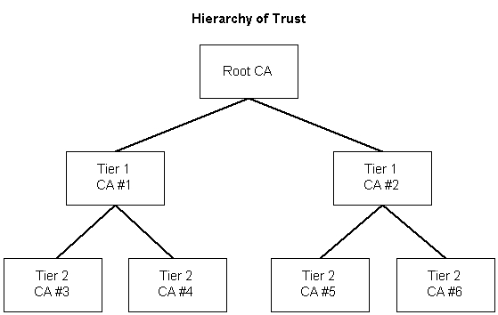
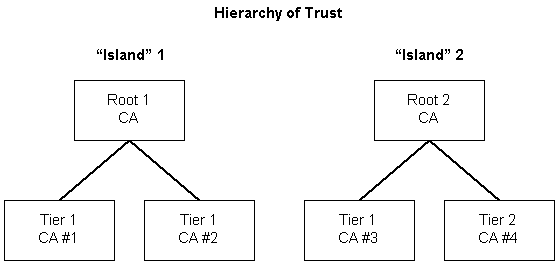

# Hierarchy of Trust

For [*digital certificates*](../secgloss/c-gly.md) to be effective, users of certificates must have a high level of trust in them. There are cases where a user does not trust the issuer of a certificate. This could happen if the certificate user has never heard of the [*certification authority*](../secgloss/c-gly.md) and therefore is uncomfortable with accepting a certificate from that issuer at face value. This problem is addressed in the certifying process by a hierarchy of trust.

A hierarchy of trust begins with at least one certification authority that is trusted by all entities in the certificate chain. This can be an internal certification authority administrator or an external company or organization that specializes in verifying identities and issuing certificates. This authority is called the [*root authority*](../secgloss/r-gly.md). The root authority then certifies other certification authorities, called first-tier certification authorities, who can then issue certificates and also certify additional or second-tier certification authorities. This situation is shown in the following illustration.

The identity of the certification authority issuing a certificate is part of a certificate. That certification authority is called the certificate's issuer. When a certificate's issuer is a tier 1 or tier 2 certification authority, the receiver of that certificate can determine whether the certificate's issuer is certified as a valid certification authority by a certification authority at a level above it, and that the higher level certification authority is certified as a valid certification authority by still a higher level certification authority until it is determined that a chain of trust exists between the lowest level certification authority and the root certification authority.

For example, in the preceding illustration, it can be verified that CA \#4 was certified as a certification authority by CA \#1, and that CA \#1 was certified as a certification authority by the root CA. Thus when a certificate from a lower-level certification authority is passed along with the encrypted message, information about all of the certificates in its chain of trust up to the root is passed along with it.

The illustration and description just presented is conceptual. In the real world, the certification authority situation is evolving and no single root authority has been established or accepted. In the short term, islands of authority will develop as shown in the following illustration.

In time, the root islands, Root 1 and Root 2 in the illustration, could become Tier 1 CAs to a single root CA. At that point, the situation would again have a single root authority. It remains to be seen just how the actual picture will evolve.

 

 
