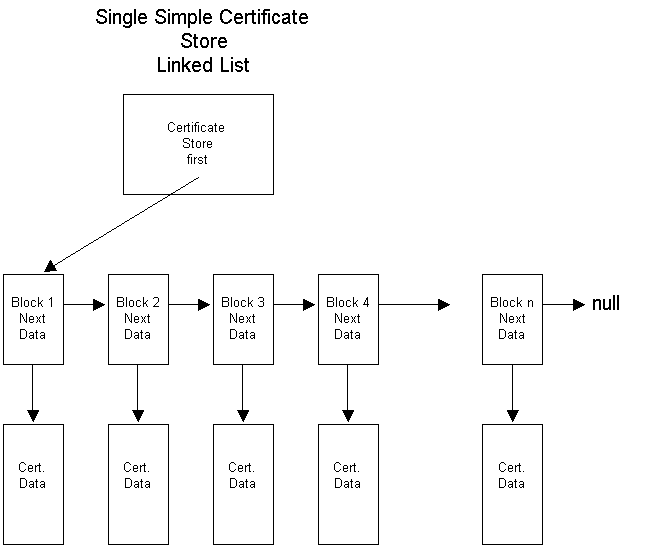

# Managing Certificates with Certificate Stores

Over a period of time, [*certificates*](https://msdn.microsoft.com/db46def4-bfdc-4801-a57d-d568e94a2dbb) will accumulate on a user's computer. Tools are required to manage these certificates. [*CryptoAPI*](https://msdn.microsoft.com/db46def4-bfdc-4801-a57d-d568e94a2dbb) provides those tools as functions to store, retrieve, delete, list (enumerate), and verify certificates. CryptoAPI also provides the means to attach certificates to messages.

CryptoAPI offers two main categories of functions for managing certificates: functions that manage [*certificate stores*](https://msdn.microsoft.com/db46def4-bfdc-4801-a57d-d568e94a2dbb), and functions that work with the certificates, [*certificate revocation lists*](https://msdn.microsoft.com/db46def4-bfdc-4801-a57d-d568e94a2dbb) (CRLs), and [*certificate trust lists*](https://msdn.microsoft.com/db46def4-bfdc-4801-a57d-d568e94a2dbb) (CTLs) within those stores.

The functions that manage [*certificate stores*](https://msdn.microsoft.com/db46def4-bfdc-4801-a57d-d568e94a2dbb) include functions for working with logical or [*virtual stores*](https://msdn.microsoft.com/412796ce-2ad5-429b-a2a6-8d286b19ae30), [*remote stores*](https://msdn.microsoft.com/ce589e18-02ac-42c2-b76b-776deb686bbd), [*external stores*](https://msdn.microsoft.com/f1caccd2-3453-448e-b194-bf899eff8091), and stores that can be relocated.

Certificates, [*CRLs*](https://msdn.microsoft.com/db46def4-bfdc-4801-a57d-d568e94a2dbb), and [*CTLs*](https://msdn.microsoft.com/db46def4-bfdc-4801-a57d-d568e94a2dbb) can be kept and maintained in [*certificate stores*](https://msdn.microsoft.com/db46def4-bfdc-4801-a57d-d568e94a2dbb). They can be retrieved from a store where they have been persisted for use in authentication processes.

The [*certificate store*](https://msdn.microsoft.com/db46def4-bfdc-4801-a57d-d568e94a2dbb) is central to all certificate functionality. The certificates are managed in the store using functions with a "Cert" prefix. A typical certificate store is a linked list of [*certificates*](https://msdn.microsoft.com/db46def4-bfdc-4801-a57d-d568e94a2dbb) as shown in the following illustration.

The preceding illustration shows:

-   Each [*certificate store*](https://msdn.microsoft.com/db46def4-bfdc-4801-a57d-d568e94a2dbb) has a pointer to the first certificate block in that store.
-   A certificate block includes a pointer to that certificate's data and a "next" pointer to the next certificate block in the store.
-   The "next" pointer in the last certificate block is set to **NULL**.
-   The data block of a certificate contains the read-only certificate context and any extended properties of the certificate.
-   The data block of each certificate contains a [*reference count*](https://msdn.microsoft.com/ce589e18-02ac-42c2-b76b-776deb686bbd) that keeps track of the number of pointers to the certificate that exist.

Certificates in a [*certificate store*](https://msdn.microsoft.com/db46def4-bfdc-4801-a57d-d568e94a2dbb) are normally kept in some kind of permanent storage such as a disk file or the system registry. Certificate stores can also be created and opened strictly in memory. A memory store provides temporary certificate storage for working with certificates that do not need to be kept.

Additional store locations allow stores to be kept and searched in various parts of a local computer's registry or, with proper permissions set, in the registry on a remote computer.

Each user has a personal My store where that user's certificates are stored. The My store can be at any one of many physical locations, including the registry on a local or remote computer, a disk file, a database, directory service, a [*smart card*](https://msdn.microsoft.com/3e9d7672-2314-45c8-8178-5a0afcfd0c50), or another location. While any certificate can be stored in the My store, this store should be reserved for a user's personal certificates: those certificates used for signing and decrypting that user's messages.

Using certificates for authentication depends on having certificates issued by some trusted certificate issuer. Certificates for trusted certificate issuers are typically kept in the Root store, which is currently persisted to a registry subkey. In the CryptoAPI context, the Root store is protected, and user interface dialog boxes remind the user to place only trusted certificates into that store. In enterprise network situations, certificates might be pushed (copied) by a system administrator from the domain controller computer to the Root stores on client computers. This process provides all members of a domain with similar trust lists.

Other certificates can be stored in the [*certification authority*](https://msdn.microsoft.com/db46def4-bfdc-4801-a57d-d568e94a2dbb) (CA) system store or in user-created, file-based stores.

For lists of functions for using and maintaining certificate stores, see [Certificate Store Functions](cryptography-functions.md).

For an example that uses some of these functions, see [Example C Program: Certificate Store Operations](example-c-program-certificate-store-operations.md).

## Related topics

<dl> <dt>

[Managing a Certificate Store State](managing-a-certificate-store-state.md)
</dt> <dt>

[Working with Certificates in Certificate Stores](working-with-certificates-in-certificate-stores.md)
</dt> <dt>

[Certificate Links](certificate-links.md)
</dt> <dt>

[Collection Stores](collection-stores.md)
</dt> <dt>

[Logical and Physical Stores](logical-and-physical-stores.md)
</dt> <dt>

[System Store Locations](system-store-locations.md)
</dt> <dt>

[Certificate Store Migration](certificate-store-migration.md)
</dt> </dl>

 

 

