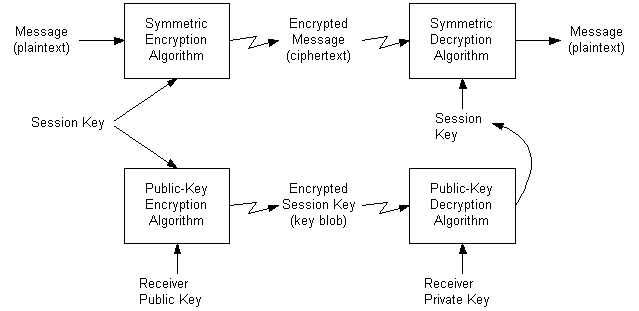

# Manual Session Key Exchanges

> [!Note]  
> The procedure described in this section assumes that the users (or CryptoAPI clients) already possess their own set of [*public/private key pairs*](https://msdn.microsoft.com/en-us/library/ms721603(v=VS.85).aspx) and have also obtained each other's [*public keys*](https://msdn.microsoft.com/en-us/library/ms721603(v=VS.85).aspx).

 

The following illustration shows how to use this procedure to send an encrypted message.

This approach is vulnerable to at least one common form of attack. An eavesdropper can acquire copies of one or more encrypted messages and the encrypted keys. Then, at some later time, the eavesdropper can send one of these messages to the receiver and the receiver will have no way of knowing the message did not come directly from the original sender. This risk can be reduced by time-stamping all messages or by using serial numbers.

The easiest way to send encrypted messages to another user is to send the message encrypted with a random session key along with the session key encrypted with the receiver's [*key exchange public key*](https://msdn.microsoft.com/en-us/library/ms721590(v=VS.85).aspx).

Following are the steps for sending an encrypted session key.

**To send an encrypted session key**

1.  Create a random [*session key*](https://msdn.microsoft.com/en-us/library/ms721625(v=VS.85).aspx) by using the [**CryptGenKey**](/windows/desktop/api/Wincrypt/nf-wincrypt-cryptgenkey) function.
2.  Encrypt the message by using the session key. This procedure is discussed in [Data Encryption and Decryption](data-encryption-and-decryption.md).
3.  Export the session key into a [*key BLOB*](https://msdn.microsoft.com/en-us/library/ms721590(v=VS.85).aspx) with the [**CryptExportKey**](/windows/desktop/api/Wincrypt/nf-wincrypt-cryptexportkey) function, specifying that the key be encrypted with the destination user's key exchange public key.
4.  Send both the encrypted message and the encrypted key BLOB to the destination user.
5.  The destination user imports the key BLOB into his or her CSP by using the [**CryptImportKey**](/windows/desktop/api/Wincrypt/nf-wincrypt-cryptimportkey) function. This will automatically decrypt the session key, provided the destination user's key exchange public key was specified in step 3.
6.  The destination user can then decrypt the message by using the session key, following the procedure discussed in [Data Encryption and Decryption](data-encryption-and-decryption.md).

 

 

