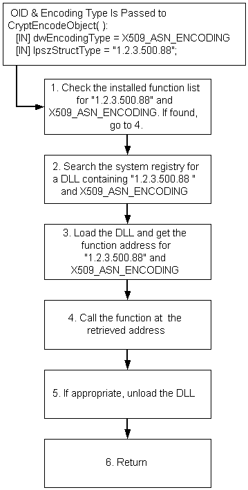

# OID Overview

Extensibility is achieved by providing for the use of new [*object identifiers*](../secgloss/o-gly.md) (OIDs), new encoding types, and new DLLs.

CryptoAPI OIDs can take any of the following forms:

-   A numeric string such as "1.2.3.500.88"
-   An alphanumeric string such as *MyFunction*
-   A constant with a value that is less than or equal to 0xFFFF. These constants are often associated with a name through the use of a **\#define** statement in a header file.

Extensible functions accept OID and encoding type arguments. These functions search the system registry to find a DLL associated with the OID and encoding type arguments passed to the function. If a DLL for the OID, encoding type combination is found, the DLL is loaded and its function is called. The following illustration shows this flow for the [**CryptEncodeObject**](/windows/desktop/api/Wincrypt/nf-wincrypt-cryptencodeobject) function:

This allows the functionality of the CryptoAPI to be extended as the need arises. Use of this methodology places a burden on the developer of the new functionality to write all the necessary code for that functionality. To encode some new data structure, for example, the function in the DLL must perform the entire encoding process.

 

 
