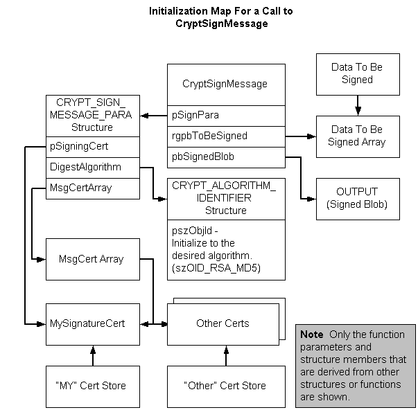

# Procedure for Signing Data

A single function, [**CryptSignMessage**](/windows/desktop/api/Wincrypt/nf-wincrypt-cryptsignmessage), performs all of the tasks listed in [Creating a Signed Message](creating-a-signed-message.md). However, initialization of structures and other data is still necessary. The following illustration shows the relationship between those function parameters that point to structures or arrays and their initialized data. The illustration shows only the function parameters and structure members that are derived from other structures or functions. The rest of the parameters are straightforward initializations.

**To sign data using CryptSignMessage**

1.  Get a pointer to the data that is to be signed.
2.  Assign the pointer to the data to index zero of a "data to be signed" array.
3.  Get a handle to the cryptographic provider.
4.  Open a [*certificate store*](../secgloss/c-gly.md) that contains the signer's certificate.
5.  Get an address to the signer's certificate.
6.  Assign the address of the certificate to the zero index of the *MsgCert* array.
7.  Assign the addresses of any other certificates to be included with the message to the *MsgCert* array.
8.  Initialize the [**CRYPT\_ALGORITHM\_IDENTIFIER**](/windows/desktop/api/Wincrypt/ns-wincrypt-crypt_algorithm_identifier) structure, initializing the **pszObjId** member to the desired hash algorithm and the other members as appropriate.
9.  Initialize the [**CRYPT\_SIGN\_MESSAGE\_PARA**](/windows/desktop/api/Wincrypt/ns-wincrypt-crypt_sign_message_para) structure, initializing the **pSigningCert** member to the address of the signer's certificate, the **MsgCert** array member to the address of the signer's and other's certificates, the **HashAlgorithm** member to the address of the [**CRYPT\_ALGORITHM\_IDENTIFIER**](/windows/desktop/api/Wincrypt/ns-wincrypt-crypt_algorithm_identifier) structure, and the other members as appropriate.
10. Call the [**CryptSignMessage**](/windows/desktop/api/Wincrypt/nf-wincrypt-cryptsignmessage) function, passing the [**CRYPT\_SIGN\_MESSAGE\_PARA**](/windows/desktop/api/Wincrypt/ns-wincrypt-crypt_sign_message_para) structure for the *pSignPara* parameter, the address of the "data to be signed" array for the *rgpbToBeSigned* parameter, an address for the *pbSignedBlob* output parameter, and values for the other parameters as appropriate.

 

 
