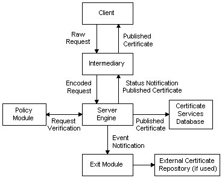

# Processing Certificate Requests

Certificate Services performs the following steps when processing a [*certificate request*](../secgloss/c-gly.md):

1.  Request reception.

    The [*certificate request*](../secgloss/c-gly.md) is sent by the client to an intermediary application, which formats it into a PKCS \#10 format request and submits it to the server engine.

2.  Request approval.

    The server engine calls the [Policy Module](policy-modules.md), which queries request properties, decides whether the request is authorized or not, and sets optional certificate properties.

3.  Certificate formation.

    If the request is approved, the server engine takes the request, and any properties requested by the Policy Module, and builds a complete certificate.

4.  Certificate publication.

    The server engine stores the completed certificate in the Certificate Services database and notifies the intermediary application of the request status. If the [exit module](exit-modules.md) has so requested, the server engine will notify it of a certificate issuance event. This allows the exit module to perform further operations such as publishing the certificate to an external certificate repository (for example, a directory service). Meanwhile, the intermediary gets the published certificate from Certificate Services and passes it back to the client.

The following illustration shows how a [*certificate request*](../secgloss/c-gly.md) is processed by Certificate Services.

 

 
