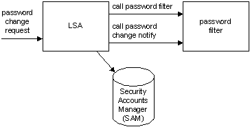

# Password Filters

Password filters provide a way for you to implement password policy and change notification.

When a password change request is made, the [*Local Security Authority*](/windows/desktop/SecGloss/l-gly) (LSA) calls the password filters registered on the system. Each password filter is called twice: first to validate the new password and then, after all filters have validated the new password, to notify the filters that the change has been made. The following illustration shows this process.

Password change notification is used to synchronize password changes to foreign account databases.

Password filters are used to enforce password policy. Filters validate new passwords and indicate whether the new password conforms to the implemented password policy.

For an overview of using password filters, see [Using Password Filters](using-password-filters.md).

For a list of password filter functions, see [Password Filter Functions](management-functions.md).

The following topics provide more information about password filters:

-   [Password Filter Programming Considerations](password-filter-programming-considerations.md)
-   [Strong Password Enforcement and Passfilt.dll](strong-password-enforcement-and-passfilt-dll.md)

 

 
