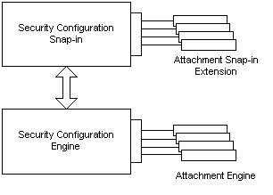

# Service Security Attachments

The Microsoft Security Configuration tool set is a set of Microsoft Management Console (MMC) tools that simplify configuration and analysis of system security. Some services, however, have specialized configuration needs that go beyond the security settings provided by the standard tool set. To handle those needs, you can extend the functionality of the tool set by writing an attachment that handles the service-specific security tasks.

For example, Spooler is a Windows NT service that defines private objects, which need to be secured, for example, printers. This functionality is not handled by the standard tool set and thus requires an attachment to handle configuration and analysis of printer objects. Configuration of general security parameters, such as the service invocation policy, is still handled by the Security Configuration tool set.

Security service attachments extend the functionality of the Security Configuration tool set to support service-specific configurations.

An attachment has two components:

-   An MMC snap-in extension that implements the attachment user interface.
-   An attachment engine that processes service-specific security configuration and analysis tasks.

The attachment snap-in extension is hosted by the Security Configuration snap-ins. These are MMC snap-ins that provide the user with interfaces to configure and analyze the general security settings for a service. Service-specific settings are configured using the attachment snap-in extension.

When the user changes a configuration setting, the Security Configuration snap-ins store the new information and then pass the request to the Security Configuration Engine. The Engine processes the request and sets the service to the new configuration. If the request affects a standard security setting, it is handled by the Engine. If the request is service-specific, the Engine calls the appropriate attachment engine to handle the request.

The following illustration shows how the attachment engine and snap-in extension work within the framework of the Security Configuration tool set.

For more information about using the Microsoft Security Configuration tool set, search for Security Configuration using your preferred search engine.

 

 

