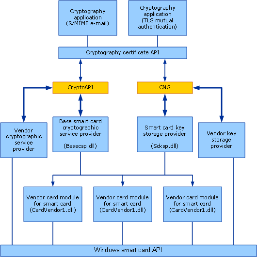

# Smart Card Architecture

This topic is not current. For the most current information about the Smart Card API, see [Smart Card Minidriver Specification](http://go.microsoft.com/fwlink/p/?linkid=178045).

The following illustration shows the architecture of Microsoft smart card support.

Cryptographic applications communicate through the [Microsoft Base Smart Card Cryptographic Service Provider](microsoft-base-smart-card-cryptographic-service-provider.md) to individual smart card modules. Smart card modules communicate through the [Smart Card Resource Manager](https://msdn.microsoft.com/library/windows/desktop/aa380148) to smart cards. For information about smart card modules, see [Smart Card Modules](smart-card-modules.md).

 

 

