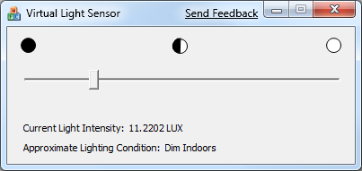

# About the Samples and Tools

The Windows SDK includes useful code samples and tools to help you understand and use the Windows Sensor and Location platform and related APIs.

## Samples

The Windows SDK includes the following Sensor API samples. You can find the Sensor API samples in the folder named \\Samples\\winui\\Sensors, where you installed the Windows SDK. For example, if you installed the Windows SDK on drive C, you would find the samples in the following folder: C:\\Program Files\\Microsoft SDKs\\Windows\\v7.0\\Samples\\winui\\Sensors.

| Sample name       | Description                                                                                                                                                                                                                                                                                                                                                                                                                                                                                                                                                            |
|-------------------|------------------------------------------------------------------------------------------------------------------------------------------------------------------------------------------------------------------------------------------------------------------------------------------------------------------------------------------------------------------------------------------------------------------------------------------------------------------------------------------------------------------------------------------------------------------------|
| AmbientLightAware | This MFC sample shows how to use the Sensor API by reading data from ambient light sensors on the computer and changing text size according to the lighting conditions. You can see code that shows how to manage events and how to request user permissions. You can also see an example of how to manage the user interface based on varying lighting conditions. For more information, see [Creating Light-Aware User Interfaces](creating-light-aware-user-interfaces.md).  You must have Visual Studio 2008 installed to build this sample.  |

 

For more information, see the file named ReadMe.txt that is included with the sample.

You can also download the AmbientLightAware sample from Code Gallery. For more information, see the [Ambient Light Aware](/samples/browse/?redirectedfrom=MSDN-samples) download page.

## Tools

The Windows SDK includes a virtual light sensor that you can use to simulate a hardware-based light sensor device. You can use this tool to provide data to the AmbientLightAware sample to see how the code in the sample works.

The following table describes the files you must use to run the virtual light sensor. You can find these files in the folder named Bin, where you installed the Windows SDK. For example, if you installed the Windows SDK on drive C on a 32-bit computer, you would find the virtual light sensor files in the following folder: C:\\Program Files\\Microsoft SDKs\\Windows\\v7.0\\Bin. On 64-bit computers, you must use the 64-bit version of the tool. In the Windows SDK, 64-bit tools are located in the subfolder named x64.

| File name                    | Description                                                                                                                    |
|------------------------------|--------------------------------------------------------------------------------------------------------------------------------|
| VirtualLightSensor.exe       | This program provides a slider control that enables you to change the level of the light data that the virtual sensor reports. |
| VirtualLightSensorDriver.dll | The logical sensor driver that simulates a light sensor.                                                                       |
| VirtualLightSensorDriver.inf | The INF file for the virtual light sensor driver.                                                                              |

 

### Installing the Virtual Light Sensor

Before you use the virtual light sensor application, you must install the logical sensor driver. Follow these steps:

1.  Open a command window as an administrator.
2.  Change to the Windows SDK Bin folder.
3.  Type **pnputil -a VirtualLightSensorDriver.inf**.
4.  When prompted, click **Install this driver software anyway**.
5.  Wait for the command window to report that the driver was successfully installed.

### Running the Virtual Light Sensor

To run the virtual light sensor, simply double-click the .exe file. Be sure to enable the sensor, when prompted.

When you run the program, you may notice that there is a delay before the sensor becomes available. The virtual light sensor user interface will display the message "Waiting" in the title bar while the logical sensor manager creates a device node for the logical sensor. After the waiting message goes away, you can use the slider to set the lux output level for the virtual light sensor.

The following image shows the virtual light sensor user interface in its ready state.

## Related topics

<dl> <dt>

[About Logical Sensors](about-logical-sensors.md)
</dt> <dt>

[**SENSOR\_CATEGORY\_LIGHT**](sensor-category-light.md)
</dt> </dl>

 

